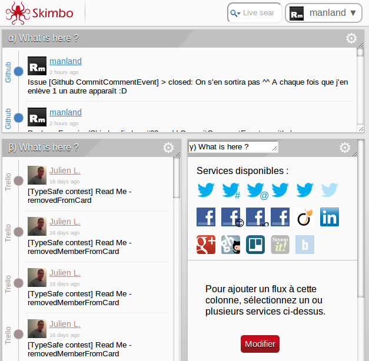
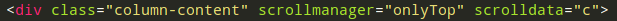
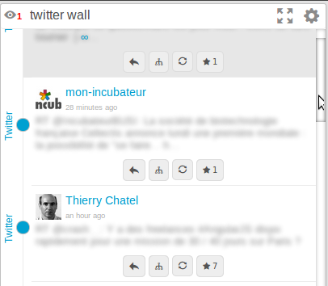
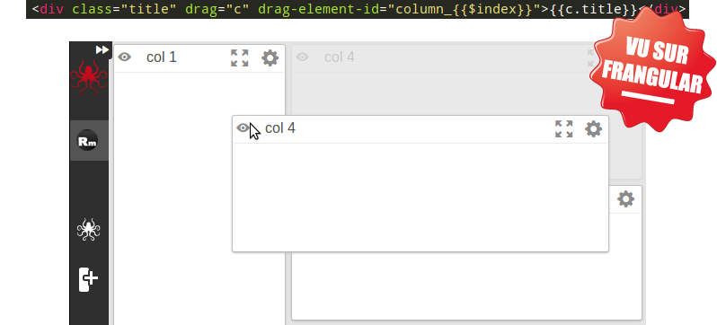
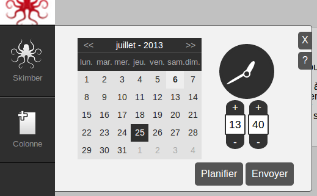
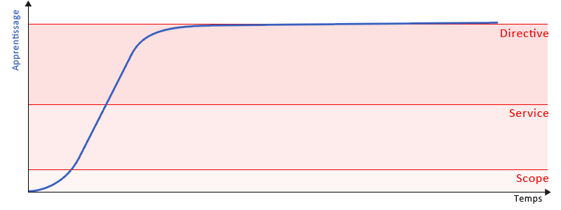

/*!SLIDE bullets ============================

Plan :

- qui suis-je : petite intro sur moi - développeur junior qui découvre js... blablabla
- le js c'était tout pourri mais ça c'était avant (js13kgame - Septembre 2012)
- angularJs vs backbone vs ember : choisir le bon framework (Discussions thierry - Octobre 2012)
- 1er code = tout dans 1 seul gros controller (skimbo - Décembre 2012)
- courbe d'apprentissage (exponentiel puis assez rapidement ralenti (on m'a dit que ça s’appelle une courbe logistique !!??))
- savoir ce qui ce passe derrière == pb d'optimisation, scope... ça freeeeze...
- 1ere directive = que du bonheur (skimbo - Janvier 2013)
- 1er rework aïaï ça fait mal... si on avait testé :'( (tout en vues séparées, un max de controller et de directive) (start-up weekend - Mai 2013)
- savoir ce qui se passe derrière == téléchargement de x fichiers : minification ne résout pas tout (ng-view...)
Il manque un tout petit truc sur le networkService et socket.io je vais voir où le caser.

*/

!SLIDE ============================

#1 an avec AngularJS

<i>Par Romain Maneschi</i>

!SLIDE bullets ============================

* Développeur depuis toujours 
 * 4 ans professionnellement
 * En poste chez 
* Développeur web++
* Développeur front++

!SLIDE ============================

#Septembre 2012


(Re)Découverte du JS... en 13Ko

!SLIDE ============================

#Novembre 2012


Mais quel framework JS choisir ?

!SLIDE ============================

<center>
<table>
  <tbody>
    <tr>
      <td></td>
      <td rowspan="2"></td>
      <td></td>
    </tr>
    <tr>
      <td></td>
      <td></td>
    </tr>
  </tbody>
</table>
</center>

!SLIDE bullets ============================

#Définitions

<i>Pour les newbies !</i>

!SLIDE bullets small ============================

* <span class="bigger red">vue</span> : fichier HTML
* <span class="bigger red">contrôleur</span> : fichier JS contrôlant la vue
* <span class="bigger red">scope</span> : objet JS reliant la vue et le contrôleur
* <span class="bigger red">service</span> : fichier JS, partagé entre plusieurs contrôleurs/services
* <span class="bigger red">directive</span> : fichier JS, permettant d'écrire de nouvelles balises HTML

!SLIDE small ============================

#Décembre 2012 - 1er code



!SLIDE bullets ============================

* 1 vue
* 1 contrôleur
* 1 service

#1500 lignes de code

<i>* Ce slide est sûrement un peu exagéré</i>

!SLIDE ============================

#Freeeeeeeze


<b>Tout dans le même scope</b><br />
<b>==</b><br />
<b>Boucle sur tous les éléments du scope</b>

!SLIDE ============================

#Janvier 2013 - 1ère directive

##"Je veux mettre à jour mon modèle quand je touche à ma vue !"

!SLIDE small ============================




#112 lignes de code

!SLIDE ============================

#Février 2013 - 2ème directive

!SLIDE small ============================


#151 lignes de code

!SLIDE ============================

#Février 2013 - 3ème directive

!SLIDE small ============================



#117 + 112 = 229 lignes de code

!SLIDE bullets ============================

#Mars 2013 - NetworkService

* On est en web-socket
* Le web-socket est coupé derrière un proxy
* On rajoute le SSE

!SLIDE bullets ============================

#Avril 2013 - NetworkService

* Le SSE est coupé avec une mauvaise connexion (3G)
* On rajoute le long-polling
* On vient de re-développer socket.io

!SLIDE ============================

##Mai 2013 - 1er (gros) rework

<b>Oups où sont les tests ?</b>

!SLIDE bullets small ============================

#Industrialisation

* Nomenclature
* Patterns

```javascript
function() {
    function myPrivateFunction() {}

    return {
      myPublicFunction: function() {
        myPrivateFunction()
}}}
```

!SLIDE ============================

##Courbe d'apprentissage



!SLIDE bullets ============================

#Conseils 1/2

* manipuler le modèle et non la vue
* tester, tester et re-tester : AngularJS fait pour ça, par ça
* comprendre ce qu'il se passe derrière (scope, ng-view, filter...)

!SLIDE bullets ============================

#Conseils 2/2

* bien s'outiller (Bower, Karma, Travis...)
* ne pas hésiter à demander des conseils (FrAngular.com, MontpellierJS...)

!SLIDE bullets ============================

#Les plus d'AngularJS

* Facilité d'utilisation (JS)
* Pas de <s>longue</s> compilation (GWT)
* En pleine ébullition (Flex)
* Séparation claire entre le client et le serveur (JSP, PHP)

!SLIDE =================

# Merci !
# Questions ? Débat ?

<center>
  <table>
    <tbody>
      <tr>
        <td align="center"></td>
        <td align="center"></td>
        <td align="center">Blog</td>
      </tr>
      <tr>
        <td>@RmManeschi</td>
        <td>manland</td>
        <td>romain.maneschi.fr</td>
      </tr>
    </tbody>
  </table>
</center>

<i>Ce slide est réalisé en AngularJS !</i>
