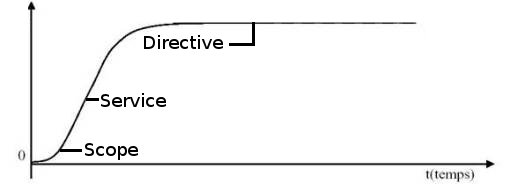
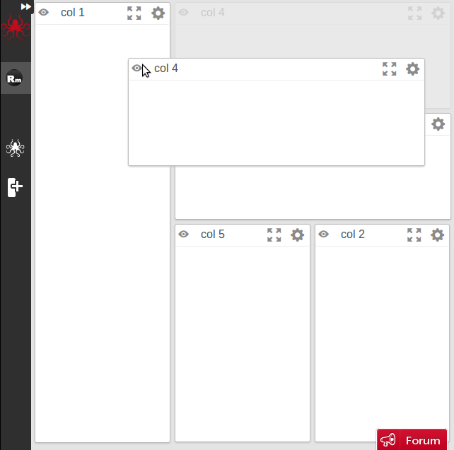
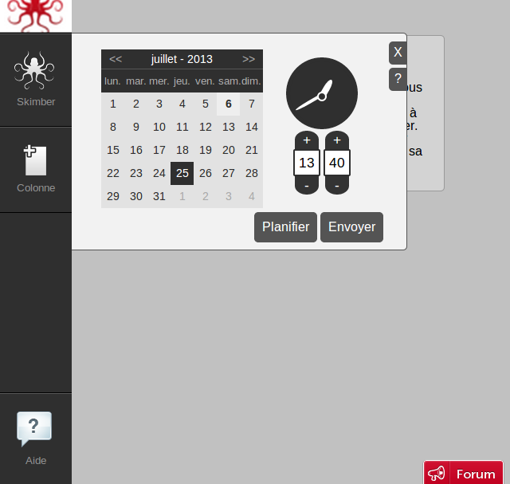

/*!SLIDE bullets ============================

Plan :

- qui suis-je : petite intro sur moi - développeur junior qui découvre js... blablabla
- le js c'était tout pourri mais ça c'était avant (js13kgame - Septembre 2012)
- angularJs vs backbone vs ember : choisir le bon framework (Discussions thierry - Octobre 2012)
- 1er code = tout dans 1 seul gros controller (skimbo - Décembre 2012)
- courbe d'apprentissage (exponentiel puis assez rapidement ralenti (on m'a dit que ça s’appelle une courbe logistique !!??))
- savoir ce qui ce passe derrière == pb d'optimisation, scope... ça freeeeze...
- 1ere directive = que du bonheur (skimbo - Janvier 2013)
- 1er rework aïaï ça fait mal... si on avait testé :'( (tout en vues séparées, un max de controller et de directive) (start-up weekend - Mai 2013)
- savoir ce qui se passe derrière == téléchargement de x fichiers : minification ne résout pas tout (ng-view...)
Il manque un tout petit truc sur le networkService et socket.io je vais voir où le caser.

*/

!SLIDE ============================

#1 an avec AngularJS

<i>Par Romain Maneschi</i>

!SLIDE bullets ============================

* Développeur depuis toujours (4 ans professionnellement)
* Développeur web++
* Développeur front++

!SLIDE ============================

#Septembre 2012


(image avec un projet froggies)

(Re)Découverte du JS... en 13Ko

!SLIDE ============================

#Novembre 2012


(image avec site + un projet froggies)

Mais quel framework JS choisir ?

!SLIDE ============================

(une image avec nuage)

<center>
<table>
  <tbody>
    <tr>
      <td></td>
      <td rowspan="2"></td>
      <td></td>
    </tr>
    <tr>
      <td></td>
      <td></td>
    </tr>
  </tbody>
</table>
</center>

!SLIDE bullets ============================

#Définitions

<i>Pour les newbies !</i>

!SLIDE bullets ============================

* view = fichier html
* controller = fichier js controllant la vue
* service = fichier js, partagé entre plusieurs controllers/services
* directive = fichier js, permettant d'écrire de nouvelles balises html

!SLIDE ============================

#Décembre 2012 - 1er code


!SLIDE bullets ============================

* 1 view
* 1 controller
* 1 service

#1500 lignes de code

<i>* Ce slide est sûrement un peu exagéré</i>

!SLIDE ============================

##Courbe d'apprentissage



!SLIDE ============================

#Freeeeeeeze

Tout dans le même scope<br />
== <br />
Tout redessiner à chaque changement

!SLIDE ============================

#Janvier 2013 - 1ère directive

##"Je veux mettre à jour mon modèle quand je touche à ma vue !"

!SLIDE ============================


!SLIDE ============================

#Février 2013 - 2ème directive

!SLIDE ============================

(vue sur frangular image)




!SLIDE ============================

#Février 2013 - 3ème directive

!SLIDE ============================




!SLIDE bullets ============================

#Mars 2013 - NetworkService

* On est en web-socket
* Le web-socket est coupé derrière un proxy
* On rajoute le Sse

!SLIDE bullets ============================

#Avril 2013 - NetworkService

* Le Sse est coupé avec une mauvaise connexion (3G)
* On rajoute le long-polling
* On vient de re-développer socket.io

!SLIDE ============================

#Mai 2013 - 1er (gros) rework

Oups où sont les tests ?

!SLIDE bullets ============================

#Industrialisation

* Nomenclature
```javascript
function() {
  function private() {}

  return {
    public: function() {private()}
}
```
* Patterns

!SLIDE bullets ============================

#Conseils 1/2

* manipuler le modèle et non la vue
* tester, tester et re-tester
* comprendre ce qui ce passe derrière (scope, ng-view, filter...)

!SLIDE bullets ============================

#Conseils 2/2

* bien s'outiller (bower, karma, travis...)
* ne pas hésiter à demander des conseils (frangular, monptellierjs...)

!SLIDE =================

# Merci !
# Questions ? Débat ?

<center>
  <table>
    <tbody>
      <tr>
        <td align="center"></td>
        <td align="center"></td>
        <td align="center">Blog</td>
      </tr>
      <tr>
        <td>@RmManeschi</td>
        <td>manland</td>
        <td>romain.maneschi.fr</td>
      </tr>
    </tbody>
  </table>
</center>
