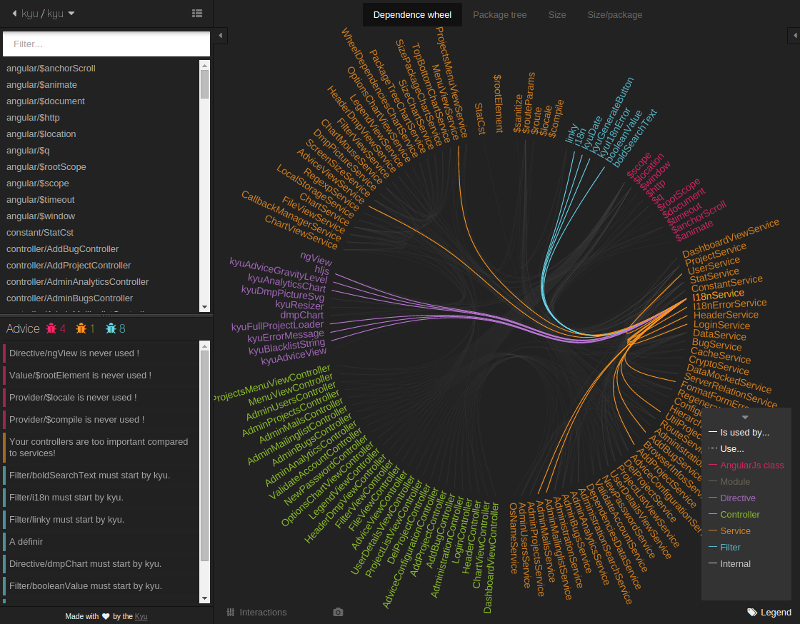

/*!SLIDE bullets ============================

Plan :

* Angular2 spoiler 15min
  * moi
    * 3 ans d'angular1, fait passer itk de gwt à angular
    * 2 mois d'angular2 -> toujours pas réussi à faire ng2 emebed !! Pas stable du tout !! Look le gitter d'angular pour avoir des infos ;)
  * Why ? 
    * reproches : angular1 2009, lent controller, scope..., watch, difficile à comprendre = trop de concepts (service, factory, provider... directive, watch de propriété)
    * en parallèle : html5 (toujours pas de localStorage dans ng1), es6 (sucre syntaxique mais...), web component, web worker
  * Nouveautés
    * tout découpé pour sortir d'angular, chacun embarque ce qu'il veut et/ou sa propre implémentation (router, di, templating...)
    * nouveau templating (beurk mais on s'y fait :D)
    * plus de double binding (1 way binding à la react)
    * Zone
    * Typescript !!! (ça existait mais pas sûr du future puis nouveau CTO microsoft et effort de google)
  * du code (en live !?) :
    * angular1 petite app vs angular2

* Angular1 project 15min
  * en attendant on peut
    * vieux, voir très vieux projet : from controller to directive
    * moyen vieux voir vieux : ajouter typescript
    * nouveau : typescript + ng1 mimic ng2
    * prochain projet (entre 3 et 6 mois) : si on se sent bien directement en ng2

*/

!SLIDE ============================

# ItSaucisse : Angular2


*Il n'y a que 2 types de langages, ceux qu'on critique tout le temps, et ceux dont on ne parle pas !*

!SLIDE bullets ============================

# Moi


* Développeur *qui aime bien le front*
* 3 ans d'Angular 1, *Fait notable : à propulser ITK de GWT à AngularJs*
* 2 mois d'Angular 2... *Pour s'amuser*

!SLIDE small ============================

### (co)créateur de Kyu



*Fermé mais peut être open-sourcé, peut être compatible ES6... Follow @KyuProject pour des news*

!SLIDE ============================

# Pourquoi tout changer ?


!SLIDE bullets smaller ============================

* Angular est vieux : 2009
* Angular est lent
  * controller, scope, watch
* Angular est compliqué
  * controller
  * services : service, factory, provider, value...
  * directive : E, A, link, controller

!SLIDE bullets smaller ============================

# Pendant ce temps, dans un pays ~~sans IE~~

* HTML 5
* ES 6
* WebWorker
* WebComponent

!SLIDE small ============================

# Réunion de crise chez Google


!SLIDE small bullets ============================

# Un meilleur monde

On garde les mêmes concepts mais on refait mieux

* Tester c'est douter
* SPA proof : DI, router, call http...
* Non intrusif ~~MyFramework.model(['id', 'name'])~~

!SLIDE bullets ============================

# Language agnostique

* Écrit en Typescript (ES6)
* Généré en Dart, ES5 et ES6
* Utilisable en Typescript (ES6 et ES5), Dart, ES5 et ES6

!SLIDE ============================

## Angular2 est en version alpha 31


*Tout ce que vous allez voir peut et va changer !*

*Pour faire ces slides je me suis basé sur : ~~la doc~~, ~~les articles des devs~~, les sources, **le gitter (chat)***

!SLIDE small ============================

# Nouveau templating

```html
<div ng-repeat="provider in providers" ng-class="provider.classes">
    
    <p ng-click="providerClick(provider)">{{provider.name}}</p>
</div>
```

```html
<div *ng-for="#provider of providers" [class]="provider.classes">
    
    <p (click)="providerClick(provider)">{{provider.name}}</p>
</div>
```

!SLIDE small ============================

# Aurevoir double binding

```html
<input type="text" ng-model="myValue">
```

```html
<input type="text" [value]="myValue" (keyup)="myValue=$event.target.value">
```

!SLIDE small ============================

# Zones.js : aurevoir $digest, $apply, $asyncApply, $timeout...

!SLIDE ============================


!SLIDE bullets small ============================

# Pourquoi ?

* Existe depuis 2012 === stable
* Surcouche === tout code JS est compatible TS
* Transpiler ES6 + annotations === aurevoir AT Script
* Communauté + outils (TSD) === facile d'utilisation

!SLIDE small ============================

# On veut voir du code !

```javascript
const quote = `"`;
const ES6 = {
  backquote: `is the new ${quote}`,
  let: `is the new var !`,
  classs: `is the new function !`,
  arrow_function: () => {`is the life !`}
}

interface TS {
  type: string;
  generic: string;
}
const ts: TS = {
  type: `my type`,
  generic: `Array<TS>`
}
```

!SLIDE small ============================

## AngularJs 1 : controller

```javascript
var app = angular.module('app', []);

app.factory('service', function() {

  var users = [];

  return {
    getUsers: function() { return users; },
    addUser: function(user) { users.push(user); }
  };

});

app.controller('controller', ['service', function(service) {

  this.users = service.getUsers();

  this.user = {};

  this.addUser = function() {
    service.addUser(this.user);
  }.bind(this);

});
```

!SLIDE ============================

## AngularJs 1 : controller

```html
<html>
  <head>...</head>
  <body ng-app="app">
    <div ng-controller="controller as ctrl">
      <ul>
        <li ng-repeat="u in ctrl.users">{{u.name}}</li>
      </ul>
      <form>
        ...
        <button ng-click="ctrl.addUser()">
      </form>
    </div>
  </body>
</html>
```
!SLIDE smaller ============================

# AngularJs 2


*Code non fonctionnel (inject)*

!SLIDE smaller ============================

```javascript
import {Injectable, Inject, Component, View, bootstrap, NgFor} from 'angular2/angular2';

class User {
  name: string;
}

@Injectable
class Service {

  users: Array<User> = [];

  getUsers(): Array<User> { return this.users; },
  addUser(user: User) { this.users.push(user); }

}

@Component({
    selector: 'user-component'
})
@View({
    templateUrl: 'UserComponent.html',
    directives: [NgFor]
})
class UserComponent {
  service: Service;
  users: Array<User>;
  user: User;

  constructor(@Inject service: Service) {
    this.service = service;
    this.users = service.getUsers();
    this.user = new User();
  }

  addUser() {
    this.service.addUser(this.user);
  }
}

bootstrap(MyAppComponent);
```

!SLIDE ============================

## AngularJs 2

```html
<ul>
  <li *ng-for="#u of users">{{u.name}}</li>
</ul>
<form>
  ...
  <button (click)="addUser()">
</form>
```

!SLIDE ============================

## AngularJs 2

```html
<html>
  <head>...</head>
  <body>

    <user-component></user-component>

  </body>
</html>
```

!SLIDE ============================

# Comment je range tout ça ?

*Proposition*

!SLIDE ============================


!SLIDE bullets smaller ============================

# Que faire de nos applis Angular 1 ?

* ~~Les jetter~~
* ~~Ne rien faire et changer de boite dans 6 mois~~
* Philosophie 0 controller (article itk-labs très bientôt)
* Passer à Typescript
* Mimic angular 2
* Passer à ES6

!SLIDE bullets smaller ============================

# Et vous qu'allez vous faire ?

