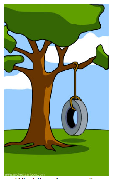

/*!SLIDE bullets ============================

Plan :

- lunette de bad dev pour les trolls un peu trop fort !
- cartons +1 / -1

* Nous développeur

* Culture développeur (30 min)

  * qu'est-ce qu'un dev
    * geek : fan de new techno
    * nerd : envie d'apprendre tout le temps
    * ouvert d'esprit, auto-dérision (+1/-1 gitlab..., ng-what, troll, habits, licornes)
    * partage, enseignement, mooc, github

  * ce n'est pas
    * un scientifique/mathématicien
    * un mec qui répare les imprimantes : on ne demande pas à un chirurgien de soigner un rhume... oui, oui même s'il sait le faire !
    * un solitaire (même s'il est souvent timide) : impossible de faire quoi que soit tout seul
    * ne tolaire pas la hiérarchie (peu être plus lié à la génération Y mais bon...) ! Et donc un (bon) chef d'entreprise (même si les start-up...)

  * notre vision de l'entreprise
    * slide à récupérer de conf (demander permission)

  * différents développeurs
    * os <app> browser < webapp (<>< poisson !) = server/db (<><= gros poisson !)
    * web/natif
    * front/back
    * sysadmin/devops/dba

  * un métier pas comme les autres
    * pas de limite (seule notre imagination)
    * tout le temps refaire/réapprendre
    * dictons : pas réinventé la roue, pas de mise en prod un vendredi, tester c'est douter, moins de ligne moins de bug, pas d'utilisateur pas de bug, loi des 2 pieds, 80% des choses prennent 20% du temps
    * pyramide de conception : on nous dit ça, on pense à, ça devient ça
      * maison avec tuyoterie sur le toit, wc à l'extérieur
    * tout le temps en échec jusqu'à la réussite
    * pas un métier en soit (le plus souvent), pas de dev pour des dev mais pour autre chose ! Et donc quand on peut on aide les autres avec de l'open-source

* OpenSource power (30 min)
  
  * libre != open (juste voir) => raisons éthiques : utiliser, modifier, redistribuer ! Oué bon...
  * big part de notre culture
    * pk les devs préfèrent ça au propriétaire ("microsoft c'est de la merde !" : règle microsoft 80/20) ?
    * attire les autres dev
    * qualité ++ car si on partage (on ne veut pas passer pour des nuls)
      * on fait attention que ce soit propre
      * on documente pour les autres
  * gratuit != opensource : tout ce qui est gratuit n'a pas de valeur, ou tout ce qui n'a pas de valeur devrait être gratuit ?
  * sécurité : "vaut-il mieux que quelqu'un nous fasse la remarque ou ne jamais savoir et quelqu'un en profite ?" (windows virus vs linux virus)
  * licences open sources
  * qui fait de l'opensource (Microsoft!) ? comment se payent-ils ?
  * qu'est-ce qu'on opensource ? google (angularjs), twitter (bootstrap, bower), facebook (react)... pas le coeur de métier, ce qu'il y a autour
  * qu'utilisons-nous d'opensource ? AngularJs, Spring, Hibernate, Postgresql, Cassandra, Eclipse, Brackets, Yoga, Firefox, Ubuntu, Tomcat
  * qu'utilisons-nous de propriétaire ? Windows, VmWare, IntelliJ (semi)
  
  * Comment on fait dans la vrai vie ? exemple 1ere pull-request d'ITK

* Conclusion

  * Pardonnez-nous d'être aussi frustrant, en réalité nous sommes juste passionés ;)
  * Pourrait-on faire plus d'OpenSource à ITK ? Commité (de dev) plutôt que de demander à des gens qui connaissent rien et qui ont pleins d'autres choses à faire ?

*/

!SLIDE ============================

# "Nous" : développeurs

!SLIDE bullets ============================

# De quoi qu'on parle ?

* La culture des développeurs
* Focus sur l'open-source

!SLIDE ============================

# Qui en parle ?

*Les propos ne concerne que moi et comme vous le savez ~~ou pas~~ je ne suis pas ~~toujours~~ de bonne foie, enfin les sources sont plus que douteuses... Vérifiez, réfutez, bref alimentez le débat !*

!SLIDE ============================

# Comment on en parle ?

Gif pas toujours animé, pas toujours drôle, pas toujours en relation

*Troll garanti*

!SLIDE small ============================

# Qu'est-ce qu'un développeur ?

## Préjugés et autres banalités

!SLIDE small ============================

# Qu'est-ce qu'un développeur ?

*Geek : fan des nouvelles technologies*

!SLIDE small ============================

# Qu'est-ce qu'un développeur ?

*Nerd : 1er de classe*

!SLIDE small ============================

# Qu'est-ce qu'un développeur ?

*Nerd : ~~1er de classe~~ aime apprendre de nouvelles choses*

!SLIDE small ============================

# Qu'est-ce qu'un développeur ?

*Partage, github, enseignement, mooc*

!SLIDE small ============================

# Qu'est-ce qu'un développeur ?

*ouvert d'esprit, auto-dérision (+1/-1 gitlab...)*

!SLIDE small ============================

# Qu'est-ce qu'un développeur ?

*Mais aussi js-what, ng-what, troll, habits, licornes...*

!SLIDE small ============================

# Un développeur n'est pas

## Toujours plus de clichés...

!SLIDE small ============================

# Un développeur n'est pas

*Un mathématicien*

!SLIDE small bullets ============================

# Un développeur n'est pas

## Un réparateur d'imprimantes !!

## On ne demande pas à un 

* chirurgien de soigner un rhume... 
* un mécanicien de repreindre sa carosserie...
* un pilote d'avion, de conduire sa voiture...

Oui, oui même s'il sait le faire... Et en particulier le dimanche en famille !

!SLIDE small ============================

# Un développeur n'est pas

*Un solitaire (même s'il est souvent timide) : impossible de faire quoi que soit tout seul*

!SLIDE small ============================

# Un développeur n'est pas

*Un ~~bon~~ chef d'entreprise (même si start-up...)*

!SLIDE small ============================

# Notre vision de l'entreprise

*Entre dev ça se passe comme ça*

## Attention trolls gratuits

!SLIDE smaller ============================

*Merci à Jean-Laurent de Morlhon pour ce slide http://fr.slideshare.net/jl.morlhon/culture-du-programmeur*

!SLIDE small ============================

# Différents types de développeurs

## Après les banalités, la théorie

!SLIDE smaller ============================

!SLIDE small ============================

# Différents types de développeurs

*Au départ, on a le hardware*

!SLIDE small ============================

# Différents types de développeurs

*Ou un datacenter, ou un téléphone, ou un raspberry pi...*

!SLIDE small ============================

# Différents types de développeurs

*Puis on a les systèmes d'exploitation*

!SLIDE small ============================

# Différents types de développeurs

*Ensuite on a les navigateurs web*

!SLIDE small ============================

# Différents types de développeurs

*Enfin les web-apps*

!SLIDE small bullets ============================

# Différents types de développeurs

* web / natif
* front / back
* sysadmin / devops / dba

!SLIDE small ============================

# Un métier pas comme les autres

## La partie cachée de l'iceberg

!SLIDE small ============================

# Un métier pas comme les autres

*Tout le temps en échec, besoin de re-faire et de ré-apprendre*

!SLIDE small ============================

# Un métier pas comme les autres

*Pas de limite (seule notre imagination)*

!SLIDE smaller bullets ============================

# Un métier pas comme les autres

* pas réinventé la roue
* pas de mise en prod un vendredi
* tester c'est douter
* moins de ligne moins de bug
* pas d'utilisateur pas de bug
* loi des 2 pieds
* 80% des choses prennent 20% du temps

!SLIDE small ============================

# Un métier pas comme les autres

!SLIDE small ============================

# Un métier pas comme les autres

*Une maison avec tuyoterie sur le toit et les wc à l'extérieur...*

!SLIDE small ============================

# Un métier pas comme les autres

Très peu de développement pour les autres développeurs mais pour des utilisateurs. Donc dès qu'on peut on aide les autres avec de l'open-source.

!SLIDE ============================

# OpenSource power

!SLIDE small ============================

# OpenSource : juste une mise au point

*libre != open (juste voir) => raisons éthiques : utiliser, modifier, redistribuer ! Oué bon...*

!SLIDE smaller ============================

# OpenSource : big part de notre culture

*Pourquoi les devs préfèrent l'open-source au propriétaire ("microsoft c'est de la merde !" : règle microsoft 80/20) ?*

!SLIDE smaller ============================

# OpenSource : big part de notre culture

*Nous sommes les ~~anonymous~~ 20% !*

!SLIDE smaller ============================

# OpenSource : big part de notre culture

*Sécurité : "vaut-il mieux que quelqu'un nous fasse la remarque ou ne jamais savoir et quelqu'un en profite ?" (windows virus vs linux virus)*

!SLIDE small bullets ============================

# OpenSource : Pourquoi devrions-nous en faire ?

* Attire les autres devs
* Ce que tu sèmes tu recevras (IntelliJ)
* Qualité ++ : si on partage on ne veut pas passer pour des nuls
  * on fait attention que ce soit propre
  * on documente pour les autres

!SLIDE small ============================

# OpenSource : Pourquoi devrions-nous en faire ?

*Gratuit != OpenSource : tout ce qui est gratuit n'a pas de valeur, ou tout ce qui n'a pas de valeur devrait être gratuit ?*

*Si tu es le meilleurs, tu peux donner des miettes aux autres*

!SLIDE smaller ============================

# OpenSource : licences faites votre marché

!SLIDE small ============================

# OpenSource : qui en fait ?

*Contributeurs du noyau linux*

!SLIDE small ============================

# OpenSource : qui en fait ?

*Qui fait de l'opensource... Microsoft ! Pour... docker !*

!SLIDE small ============================

# OpenSource : comment se payent-ils ?

!SLIDE small ============================

# OpenSource : quoi qu'on open-source ?

*Google (angularjs), Twitter (bootstrap, bower), Facebook (react), Microsoft (typescript)... pas le coeur de métier, ce qu'il y a autour*

!SLIDE small ============================

# OpenSource : qu'utilisons-nous

*d'opensource ? AngularJs, Spring, Hibernate, Postgresql, Cassandra, Eclipse, Brackets, Yoga, Firefox, Ubuntu, Debian, Tomcat, Maven, Npm, Gulp...*

*de propriétaire ? Windows, VmWare, IntelliJ (semi), Matlab, Photoshop*

!SLIDE small ============================

# Comment on fait dans la vrai vie ? 

# Exemple 1ere pull-request d'ITK

IMAGE ITK LOVE OPEN-SOURCE

!SLIDE small ============================

# Conclusion

*Enfin presque...*

!SLIDE small ============================

*Pardonnez-nous d'être aussi ~~con~~ ~~gamin~~ frustrant, en réalité nous sommes juste passionnés ;)*

!SLIDE small ============================

# Pourrait-on faire plus d'OpenSource à ITK ? 

## Proposition : commité (de dev) plutôt que de demander à des gens qui connaissent rien et qui ont pleins d'autres choses à faire ?

!SLIDE small ============================

# Merci ITK de me donner cet espace temps d'échanges !

