/*!SLIDE bullets ============================

Plan :

* GWT
  * 4p : vieille façon, full java, RPC
  * préco : nouvelle façon mais HorizontalPanel ==> html page compilée
  * dispeau : enfin le web
* GWT avant c'était bien mais ça c'était avant
* Si on fait du web pourquoi faire du java ?

* pb de mémoire non maitrisé
* pb de map sur dispeau

* HTML, CSS & JS <- si on fait une div, c'est uen div qui apparait

* Directive ! I LOVE IT !
* tests

* ce qu'angularjs ne permettra pas
  * mode déconnecté
  * sécurité de nos applis
  * mode téléphone/tablette

* Défits : Serveur à découpler de gwt, Nouveau langage a découvrir
* Pb : IDE JetBrains WebStorm

* Ce que l'on perd : 
  * relation serveur/client facilité
  * 1 seul langage
* Ce que l'on gagne : 
  * vue plus facile (pas d'interface pour le css O_o)
  * laurent peu faire beaucoup + de choses, test client intégré
  * Changement de version client moins chère
  * Découplage Client/serveur == diviser pour mieu régner, pour se spécialiser, centraliser un serveur/bd
  * autre client facilité car non dépendant d'une technologie
  * mocker le client, parallélisme serveur non obligatoire

* Tenir compte des erreurs du passé :
  * tests
  * intégration continue

*/

!SLIDE ============================

# GWT

"La meilleure réalisation technique, de la plus mauvaise idée !"

!SLIDE bullets ============================

# Pourquoi ? 

* 1 code pour tous les navigateurs
* 1 langage pour le client et le serveur

!SLIDE =================

# Où en sommes-nous ?

!SLIDE =================

### 4P : tout en java

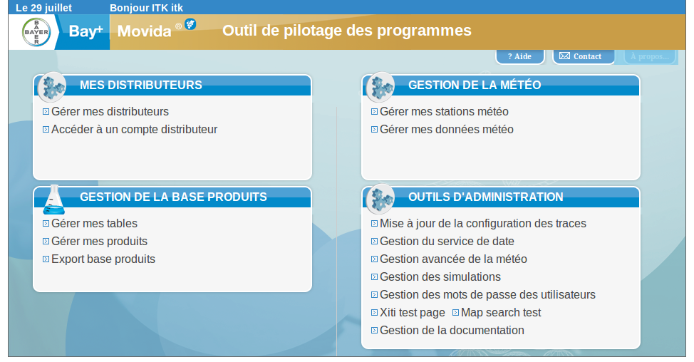

!SLIDE =================

### 4P : tout en java

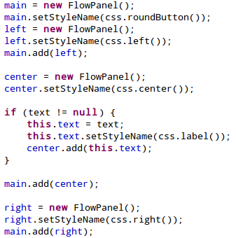

!SLIDE =================

### 4P : tout en java

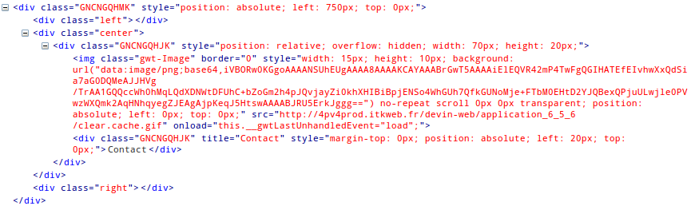

!SLIDE =================

### Préco : nouvelle façon, mais mal utilisé

!SLIDE =================

### Préco : nouvelle façon, mais mal utilisé

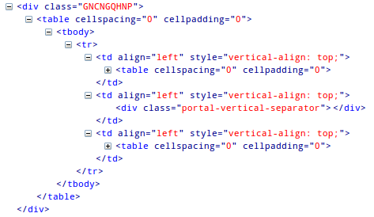

!SLIDE bullets =================

### Dispeau : ça change tout

* Besoin de réactivité
* Le client devient aussi important que le serveur
* Responsive pour les tablettes
* GWT ne nous aide pas, mais c'est possible...

!SLIDE bullets =====================

# Mais alors, pourquoi changer ?

* Le JS se standardise
* Les librairies JS prennent le relai (quand il faut)

!SLIDE bullets =====================

# Mais alors, pourquoi changer ?

* Reprendre le contrôle de notre code
* Pas de compilation nécessaire
* ... et GWT ne suit plus ...

!SLIDE =================

# Dispeau map

!SLIDE bullets =================

# Dispeau map

* Lib JS

!SLIDE bullets =================

# Dispeau map

* Lib JS
* Wrapper GWT

!SLIDE bullets =================

# Dispeau map

* Lib JS
* Wrapper GWT
* Compilation JS

!SLIDE bullets =================

# Convaincu ? Perte de temps inutile ? 

"En tant que de dev front-end, venant du web, pour le web, ce n'est plus possible !"

!SLIDE bullets =================

* Google donne GWT à la communauté (se retire de GWT *)
* Mais la communauté est inexistante... 

<i>* Ce slide peut contenir un troll</i>

!SLIDE =================

# Le serveur gère le métier, le client l'affiche...

!SLIDE =================

# AngularJs

!SLIDE =================

Your name: <input ng-model="me" name="name" autocomplete="off" style="font-size: 1em; width: 7em;"> 
Hello {{me}}!

 

    Your name: <input ng-model="me">
    Hello {{me}}!

!SLIDE bullets =================

# AngularJs permet d'architecturer le client

* Vues en HTML/CSS
* Contrôleurs en JS
* Services en JS

!SLIDE =================

# Directive == HTML6

&#60;monCompo mes-params="value">&#60;/monCompo>

!SLIDE =================

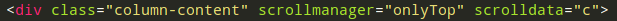

!SLIDE =================

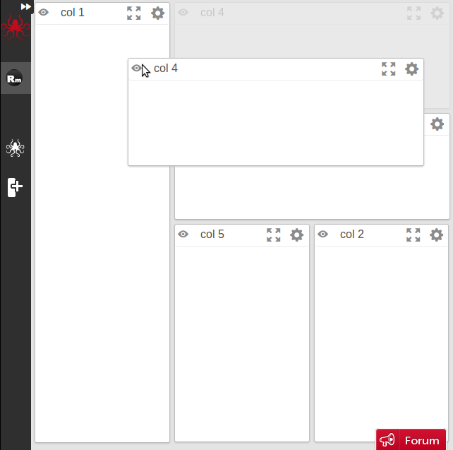

!SLIDE =================

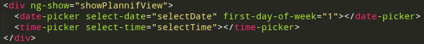

!SLIDE bullets =================

# Tests

* "La plupart des bugs viennent du client" <i>Cuong</i>
* "Tester les DAOs, puis les services côté serveur" <i>Bastien & Nelly</i>
* "Tester du java pour finalement jouer du js n'a pas de sens" <i>votre serviteur</i>

!SLIDE =================

### AngularJs == par les tests == pour les tests

!SLIDE =================

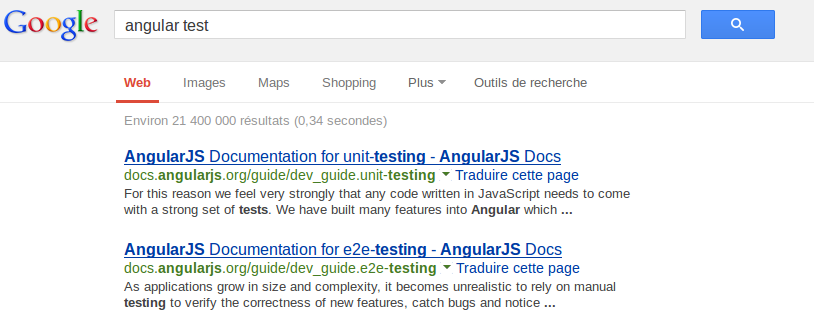

!SLIDE bullets =================

## AngularJs ne résoudra pas

* Mode téléphone/tablette
* Mode déconnecté
* Sécurité de nos applis

### Il nous permettra de les aborder d'une nouvelle façon

!SLIDE =================

# Défis

!SLIDE =================

# Transfert des données

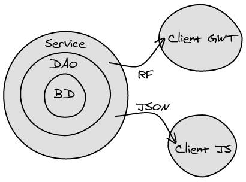

!SLIDE bullets =================

# Nouveau(x) langage(s)

* JS, HTML5, CSS3
* (presque) fonctionnel
* prototype
* dynamique

!SLIDE =================

# Problèmes

!SLIDE =================

# PAS D'IDE qui sort du lot

SublimeText, WebStorm, Brackets...

!SLIDE bullets =================

# Mais on y gagne...

* Vue plus facile (pas d'interface pour le css O_o)
* Tests clients intégrés
* Changement de version moins cher

!SLIDE bullets =================

* Serveur REST réutilisable (application mobile, native...)
* Autre client facilité car non dépendant d'une technologie
* Découplage client/serveur : diviser pour mieux régner, pour se spécialiser, centraliser un serveur/bd
* Mocker le client, parallélisme serveur non obligatoire

!SLIDE bullets =================

* Laurent peut faire beaucoup plus de choses

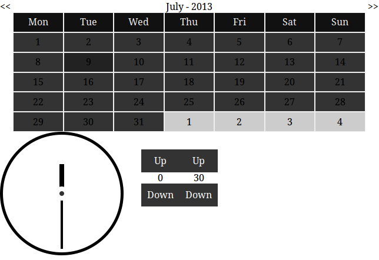

!SLIDE bullets =================

* Pas de photoshop ! Directement dans le code !

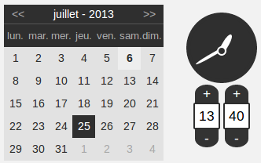

!SLIDE bullets =================

# Tenir compte des erreurs du passé

* Tests
* Intégration continue
* Veille techno web-components...

!SLIDE bullets =================

# Dans tous les cas n'oubliez pas :

* Roadmap GWT où Google ne fait rien
* AngularJs n'est qu'une des possibilités (ember, backbone...)

!SLIDE =================

# Merci !
# Questions ? Débat ?
