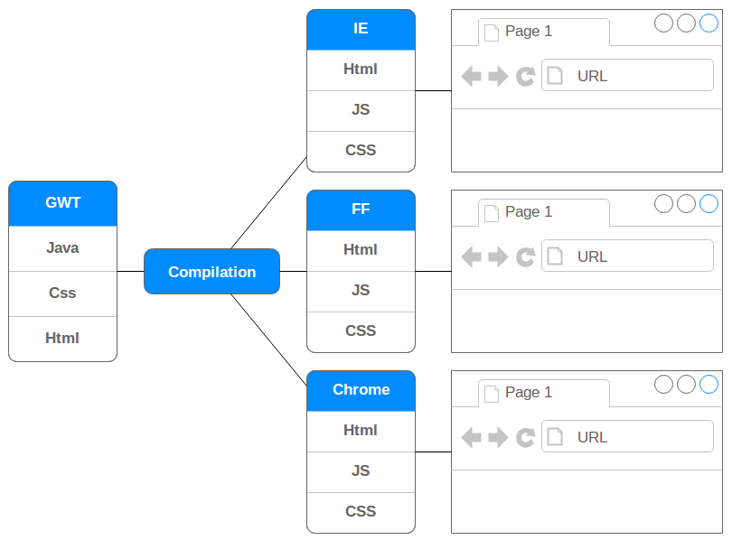
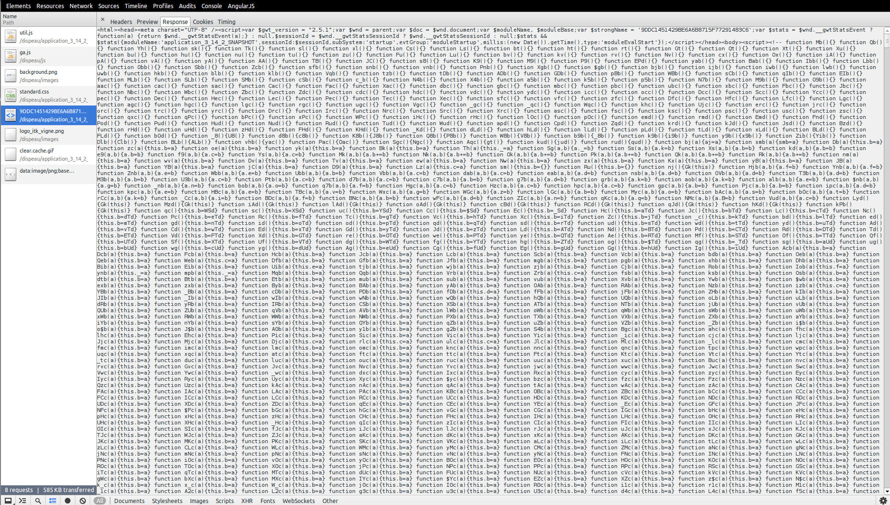
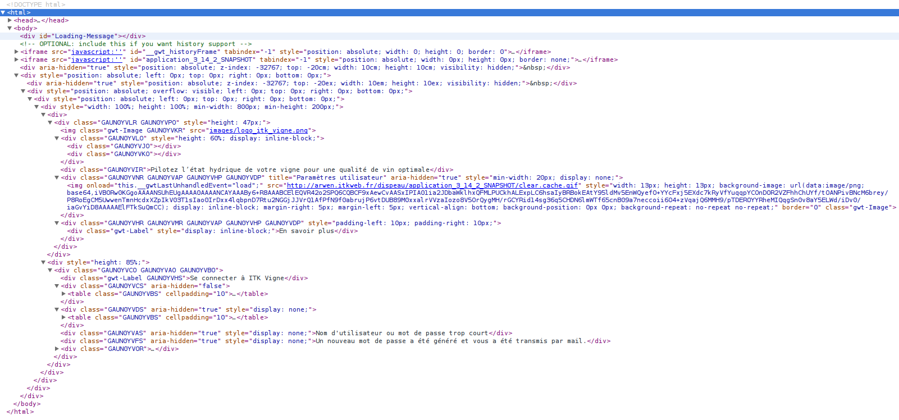

!SLIDE ============================

# GWT

"La meilleure réalisation technique, de la plus mauvaise idée !"

*Ce slide est réalisé en AngularJS !*

!SLIDE ============================

# Bienvenu dans le monde merveilleux du web


!SLIDE bullets ============================

# Pré-requis

* Etre convaincu que l'HTML, le CSS et le JS sont les seuls "langages" interprétables dans un navigateur web
* Etre convaincu que GWT est en Java

!SLIDE ============================

#Qu'est-ce qu'une page web ?

!SLIDE ============================

```html

<head>
  <!-- META -->
</head>
<body>
  <!-- BODY -->
</body>

```

!SLIDE ============================

#Le body

Ensemble de balises HTML (span, ul, li, table, div...)

```html
Décrit les conteneurs
```

!SLIDE ============================

#Le body

Ensemble de classes CSS

```html
Décrit la façon dont les conteneurs sont affichés
```

!SLIDE ============================

#Le body

Ensemble de fichiers JS

```html
Décrit les intéractions entre la donnée (le modèle) 
et le style d'affichage
```

!SLIDE ============================

#WTF ? Où est le Java de GWT dans tout ça ?


!SLIDE bullets ============================

#Historique : année 1860*

Chaque navigateur à son implémentation de : CSS, JS, HTML...

**à quelques années près*

!SLIDE bullets ============================

#GWT but

* 1 implémentation en Java
* Même langage pour le client et le serveur
* X compilations (permutations) pour chaque navigateur

!SLIDE ============================



!SLIDE bullets ============================

#Appli GWT packages

* client
* server
* shared

!SLIDE bullets ============================

#Appli GWT packages

* client <-- tout est transformé en js
* server
* shared

!SLIDE bullets ============================

#Appli GWT packages

* client <-- tout est transformé en js
* server <-- tout ce qui reste en java
* shared

!SLIDE bullets ============================

#Appli GWT packages

* client <-- tout est transformé en js
* server <-- tout ce qui reste en java
* shared <-- les 2

!SLIDE bullets ============================

#Package client

* Utiliser que des classes de :
  * java.lang
  * nos packages client et shared
  * libs spéciales pour client (gwt.client...)
* Ecrire directement en JNDI

!SLIDE ============================


!SLIDE bullets ============================

#Balises fun

* audio
* video
* canvas

*Mal supportées ou non présentes dans GWT*

!SLIDE bullets ============================

#Balises sémantiques

* nav
* section
* footer

*Non présentes dans GWT*

!SLIDE bullets ============================

#Faire de l'HTML<s>5</s> en GWT

* *ViewImpl.ui.xml
* *ViewImpl.java

!SLIDE bullets ============================

#Exemple

*ViewImpl.ui.xml

```xml
<g:FlowPanel />
```

*ViewImpl.java

```java
new FlowPanel()
```

!SLIDE bullets ============================

#Le problème des tableaux

* Lourds (5 balises : table, tr, td, tbody)
* Pas responsive : un tableau ne tombe pas
* Très difficilement adaptable à la taille (x colonnes en % autres en px...)

!SLIDE ============================

#GWT est gavé de tableau :'(

!SLIDE ============================

#HorizontalPanel

```java
HorizontalPanel hp = new HorizontalPanel();
TextInput textInput = new TextInput();
hp.add(textInput);
Button b = new Button("Test");
hp.add(b);
```

!SLIDE ============================

#HorizontalPanel

```html
<table>
  <tr>
    <td><div><input type="text" /></div><td>
  </tr>
  <tr>
    <td><div><input type="button" value="Test" /></div><td>
  </tr>
</table>
```

*Classes CSS supprimées*

!SLIDE ============================

#Normalement

```html
<div>
  <input type="text" />
  <button>Test</button>
</div>
```

!SLIDE ============================

#Faire comprendre à GWT qu'on veut une div

```java
FlowPanel fp = new FlowPanel();
TextInput textInput = new TextInput();
fp.add(textInput);
MyButton b = new MyButton("Test");
fp.add(b);
```

!SLIDE ============================

#Oui mais moi je veux quand même faire un tableau

Si tu veux vraiment, fais le ! Exemple : préco

!SLIDE ============================

#Nombre d'élément dans le DOM

<pre>"C'est comme les problèmes : moins on en a au mieux on se porte"</pre>

!SLIDE bullets ============================

#Pourquoi ui.xml et java ?

Tout est traduit en JS et ajouter à la volée.

*Idem en AngularJs avec les ng-view*

!SLIDE ============================



!SLIDE ============================



!SLIDE bullets ============================

Dans le ui.xml on met :

* Toutes les déclarations des composants
* Toutes les déclarations des css (with)
* Si un paramètre est posé, on regarde le @constructor, puis un setter

!SLIDE small ============================

```xml
<ui:UiBinder xmlns:ui="urn:ui:com.google.gwt.uibinder"
  xmlns:g="urn:import:com.google.gwt.user.client.ui">
  
  <ui:with field='res'
    type='com.itkweb.precovision.client.resources.CommonResources' />
  <ui:with field='resObservation'
    type='com.itkweb.precovision.client.resources.ObservationResources' />
    
    <g:FlowPanel>
      <g:FlowPanel addStyleNames="{res.css.tabHeader} {res.css.content}">
        <g:Label ui:field="mainTitle" 
          addStyleNames="{res.css.mainTitleStyle}" />
        <g:Label ui:field="secondTitle" 
          addStyleNames="{res.css.mainTitleStyle}" />
      </g:FlowPanel>
    </g:FlowPanel>
</ui:UiBinder>
```

!SLIDE bullets ============================

Dans le java on met :

* @UiField pour récupérer un composant (dans l'ordre de la vue)
* @UiField(provided=true) pour l'instancier nous même (avant initWidget)
* Toutes les intéractions IHM (click, move...)

!SLIDE small ============================

```java
public class ObservationViewImpl 
  extends AbstractComposite 
  implements ObservationView, Handler<ObservationElementProxy> {

  protected static ObservationVIewImplUiBinder uiBinder = 
    GWT.create(ObservationVIewImplUiBinder.class);

  interface ObservationVIewImplUiBinder 
    extends UiBinder<Widget, ObservationViewImpl> {
  }

  @UiField
  Label mainTitle;
  @UiField(provided=true)
  Label secondTitle;

  public ObservationViewImpl() {
    CommonResources.INSTANCE.css().ensureInjected();
    ObservationResources.INSTANCE.css().ensureInjected();
    secondTitle = new Label("est trop fort");
    initWidget(uiBinder.createAndBindUi(this));
    mainTitle.setText("Romain");
  }
}

```

!SLIDE ============================


!SLIDE ============================

##Décrire le style des éléments

<div style="background-color:red; width:50px; height:50px;"></div>

```css
.red {
  background-color:red; 
  width:50px; 
  height:50px;
}
```

<div style="background-color:green; width:50px; height:50px;"></div>

```css
.green {
  background-color:red; 
  width:50px; 
  height:50px;
}
```

!SLIDE ============================

##Factoriser

```css
.red, .green {
  width:50px; 
  height:50px;
}
.red {
  background-color:red; 
}
.green {
  background-color:green; 
}
```

!SLIDE ============================

##Spécialiser

```css
.red .green {
  width:50px; 
  height:50px;
}
.red {
  background-color:red; 
}
.green {
  background-color:green; 
}
```

##Que fait ce code sur les éléments précédents ?

!SLIDE ============================

#Résultat

<div style="background-color:red;"></div>

!SLIDE ============================

#Pourquoi ?

> Aucun élément green dans red

!SLIDE ============================

#Correction HTML

```html
<div class="red"><div class="green"></div></div>

```

<div style="background-color:red;"><div style="background-color:green; width:50px; height:50px;"></div></div>

*Y a un problème docteur !?*

!SLIDE bullets ============================

#Placement en CSS

* Display : block, inline, inline-block
* Display exotiques : table, table-cell, table-row...
* Position : relative, absolute

!SLIDE bullets ============================

#display block

Je prend toute la place et j'oblige les autres à être dessous

<div style="background-color:red;"><div style="width:10px; height:50px;"></div></div>
<div style="background-color:green;"><div style="width:10px; height:50px;"></div></div>

!SLIDE bullets ============================

#display inline

Je ne prend pas de taille, seul mes fils compte

<div style="display:inline;"><div style="background-color:red;width:50px; height:50px;"></div></div>
<div style="background-color:green;"><div style="width:10px; height:50px;"></div></div>

!SLIDE bullets ============================

#display inline-block

Je prend la place de mes fils

<div style="display:inline-block;"><div style="background-color:red;width:50px; height:50px;"></div></div>
<div style="background-color:green;"><div style="width:10px; height:50px;"></div></div>

!SLIDE bullets ============================

#float

J'ai aucune taille et je me positionne où on me dit

<div style="display:block;"><div style="background-color:red;width:50px; height:50px;float: right"></div></div>
<div style="display:block;"><div style="background-color:green;width:50px; height:50px;float:left"></div></div>

!SLIDE bullets ============================

#absolute

J'ai aucune taille et je me positionne où on me dit précisément

<div style="position:absolute;top:100px;right:250px;"><div style="background-color:red;width:50px; height:50px;float: right"></div></div>
<div style="position:absolute;top:20px;left:120px;"><div style="background-color:green;width:50px; height:50px;float:left"></div></div>

!SLIDE bullets ============================

#Il en manque encore

* text-align : place le contenu (et donc le texte mais pas que)
* line-height : hauteur du contenu
* font-size : taille du texte

!SLIDE bullets ============================

#Il en manque encore

* color : couleur du texte
* border : taille type et couleur de la bordure
* border-radius : faire des jolis coins ronds

!SLIDE bullets ============================

#Mais alors comment devenir un css-ifieur confirmé ?

!SLIDE bullets ============================

#Il faut saigner du nez !

!SLIDE bullets ============================

#GWT et le CSS

- Optimiste : au moins un truc auquel ils ont pas touché
- Pessimiste : oué mais il faut 4 classes java pour créer une classe css

!SLIDE ============================

#Accrochez-vous, c'est parti

!SLIDE bullets ============================

* Créer un fichier css dans les ressources
* Créer une interface qui étend "ClientBundle"
* Créer une interface, dans l'interface précédente, qui étend CssRessource
* Créer une méthode dans la 1ere interface qui a une annonation référançant le fichier css

!SLIDE ============================

```css
.maClass {...}
```

```java
public interface ObservationResources extends ClientBundle {

  public final static ObservationResources INSTANCE = 
     GWT.create(ObservationResources.class);

  public interface Css extends CssResource {
    public String maClass();
  }

  @Source("style/Observation.css")
  Css css();
}
```

!SLIDE small ============================

#Utilisation dans le ui.xml

```xml
<ui:UiBinder xmlns:ui="urn:ui:com.google.gwt.uibinder"
  xmlns:g="urn:import:com.google.gwt.user.client.ui">
  
  <ui:with field='res'
    type='com.itkweb.precovision.client.resources.CommonResources' />
  <ui:with field='resObservation'
    type='com.itkweb.precovision.client.resources.ObservationResources' />
    
    <g:FlowPanel>
      <g:FlowPanel addStyleNames="{res.css.tabHeader} {res.css.content}">
        <g:Label ui:field="mainTitle" 
          addStyleNames="{res.css.mainTitleStyle}" />
        <g:Label ui:field="secondTitle" 
          addStyleNames="{res.css.mainTitleStyle}" />
      </g:FlowPanel>
    </g:FlowPanel>
</ui:UiBinder>
```

!SLIDE ============================

#Utilisation dans le Java

```java
ObservationResources style = ObservationResources.INSTANCE.css();
monFlowPanel.addStyleName(style.maClass());
```

!SLIDE ============================

#TODO : remove une classe avant d'appliquer la suivante

```java
ObservationResources style = ObservationResources.INSTANCE.css();
monFlowPanel.removeStyleName(style.maClassBold());
monFlowPanel.addStyleName(style.maClassNormal());
```

!SLIDE ============================

#Les images

!SLIDE bullets ============================

* Poser votre image dans les ressources
* Créer une interface qui étend "ClientBundle"
* Créer une méthode dans la 1ere interface qui a une annonation référançant le fichier

*Ca vous rappel les css ? normal c'est la même chose !*

!SLIDE ============================

```java
public interface ObservationResources extends ClientBundle {

  @Source("icon/button/icon_tab_profil_normal.png")
  @ImageOptions(flipRtl = true)
  public ImageResource customerTab();

}
```

!SLIDE small ============================

#Utilisation dans le ui.xml

```xml
<ui:UiBinder xmlns:ui="urn:ui:com.google.gwt.uibinder"
  xmlns:g="urn:import:com.google.gwt.user.client.ui">
  
  <ui:with field='res'
    type='com.itkweb.precovision.client.resources.CommonResources' />
  <ui:with field='resObservation'
    type='com.itkweb.precovision.client.resources.ObservationResources' />
    
    <g:FlowPanel>
      <g:Image resource="{resObservation.customerTab}" />
    </g:FlowPanel>
</ui:UiBinder>
```

!SLIDE bullets ============================

#Utilisation dans le Java

```java
ObservationResources style = ObservationResources.INSTANCE;
monImage.setResource(style.customerTab());
```

!SLIDE ============================


!SLIDE bullets ============================

#Package client : rappel

* Utiliser que des classes
  * qui viennent de java.lang
  * qui viennent de nos packages client et shared
  * qui viennent de libs spéciales pour client
* Ecrire directement en JNDI

!SLIDE ============================

#JNDI

Java Naming and Directory Interface === Dès qu'on veut faire autre chose que du Java en Java

!SLIDE smaller ============================

```java
/**
* Add a frame to the work stack.
* 
* <pre>
*  frame := {suffixNames, subtrees, prefix, index}
*  suffixNames := All suffixes in the target PrefixTree
*  subtrees := All subtrees in the target PrefixTree
*  prefix := A string that next() will prepend to output from the frame
*  index := Stores which suffix was last output
* </pre>
* 
* @param tree
*            The tree to add
* @param prefix
*            The prefix to prepend to values in tree
*/
private native void addTree(PrefixTree tree, String prefix) /*-{
var suffixes = [];
for ( var suffix in tree.@com.itkweb.precovision.client.ui.util.oracle.PrefixTree::suffixes) {
  // Ignore object properties that aren't colon-prepended keys
  if (suffix.indexOf(':') == 0) {
    suffixes.push(suffix);
  }
}

var frame = {
  suffixNames : suffixes,
  subtrees : tree.@com.itkweb.precovision.client.ui.util.oracle.PrefixTree::subtrees,
  prefix : prefix,
  index : 0
};

var stack = this.@com.itkweb.precovision.client.ui.util.oracle.PrefixTree$PrefixTreeIterator::stack;
stack.push(frame);
}-*/;
```

!SLIDE smaller ============================

```javascript
var suffixes = [];
for ( var suffix in tree.@com.itkweb.precovision.client.ui.util.oracle.PrefixTree::suffixes) {
  // Ignore object properties that aren't colon-prepended keys
  if (suffix.indexOf(':') == 0) {
    suffixes.push(suffix);
  }
}

var frame = {
  suffixNames : suffixes,
  subtrees : tree.@com.itkweb.precovision.client.ui.util.oracle.PrefixTree::subtrees,
  prefix : prefix,
  index : 0
};

var stack = this.@com.itkweb.precovision.client.ui.util.oracle.PrefixTree$PrefixTreeIterator::stack;
stack.push(frame);
```

!SLIDE bullets ============================

#On ne fais pas de JNDI :

* 1 seul langage
* Problème de fuite mémoire avec GWT

!SLIDE bullets ============================

# Pré-requis : rappel

* Etre convaincu que l'HTML, le CSS et le JS sont les seuls "langages" interprétables dans un navigateur web
* Etre convaincu que GWT est en Java

!SLIDE ============================

# Passons aux choses sérieuses

#GWT les petits trucs à savoir

!SLIDE bullets ============================