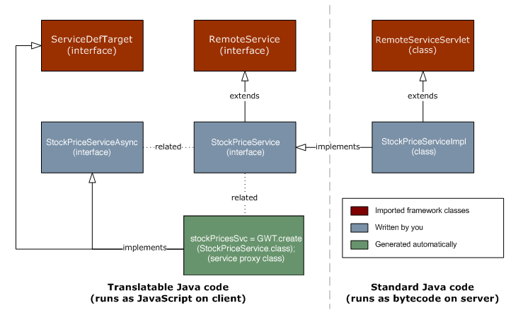
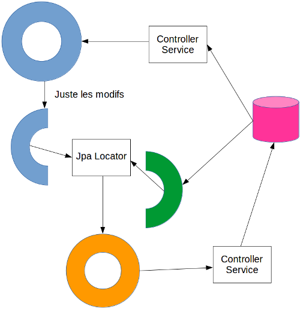
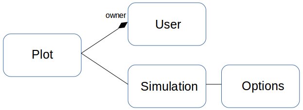
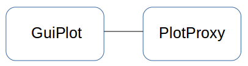
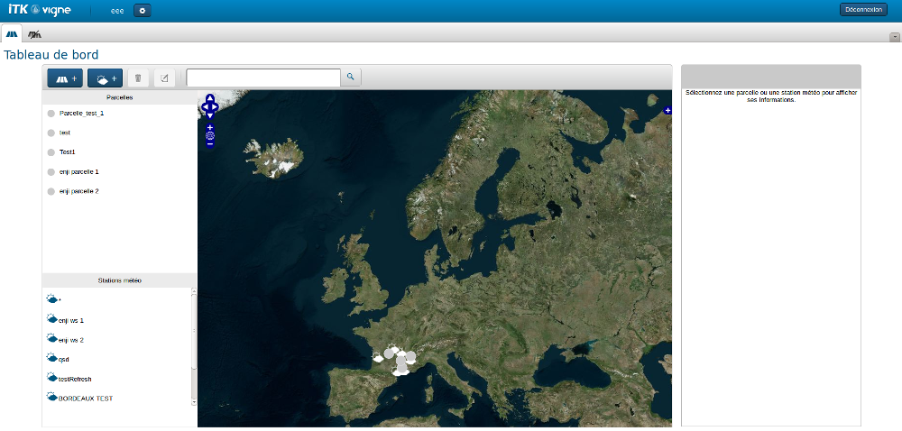
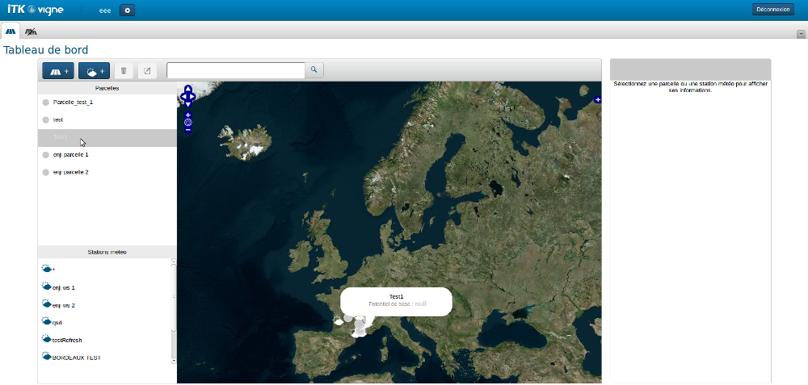
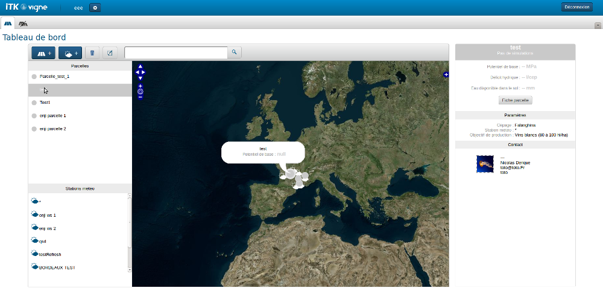

!SLIDE ============================

# GWT

"La meilleure réalisation technique, de la plus mauvaise idée !"

*Ce slide est réalisé en AngularJS !*

!SLIDE ============================

# Bienvenu dans le monde merveilleux du web


!SLIDE bullets ============================

#Nous allons parler de

* RPC vs RF
* GuiModel : faire un modèle client side
* Pattern Observer : rendre réactif son app simplement
* Activity/View/ViewImpl/ui.xml : où on met quoi ?
* F5 : quand ? pourquoi ?

!SLIDE bullets small ============================

<i>Wikipedia : </i>

* RPC : (Remote Procedure Call) est un protocole réseau permettant de faire des appels de procédures sur un ordinateur distant à l'aide d'un serveur d'applications.

<i>Google (approximatif car traduit par moi) : </i>

* RF : Idem à RPC mais permet une approche basée sur la donnée au lieu des services.

!SLIDE ============================

#RPC



!SLIDE ============================

#Controller - Interface

```java
@RemoteServiceRelativePath("plots")
public interface PlotsController extends RemoteService {

  List<Plot> getPlots(Integer idUser);

}
```

!SLIDE ============================

#Controller - Implémentation

```java
public class PlotsControllerImpl extends RemoteServiceServlet implements PlotsController {

  @Autowire
  PlotsService plotsService;

  public List<Plot> getPlots(Integer idUser) {
    return plotsService.getPlots(idUser);
  }

}
```

!SLIDE ============================

#Client - Interface

```java

public interface PlotsControllerAsync {
  void getPlots(Integer idUser, AsyncCallback<List<Plot>> callback);
}
```

!SLIDE ============================

#Client - Call

```java
List<Plot> plots;

AsyncCallback<List<Plot>> callback = new AsyncCallback<List<Plot>>() {
  public void onFailure(Throwable caught) {
    // TODO: Do something with errors.
  }

  public void onSuccess(List<Plot> plots) {
    MaClass.this.plots = plots;
  }
};

this.plots.size();//null pointer ! WTF ? 
```

!SLIDE ============================

#Et le plot dans tout ça ?

```java
public class Plot implements Serializable {
  
  private String name;

  public Plot() {}

  public String getName() {
    return name;
  }

  public void setName(String name) {
    this.name = name;
  }

}
```

!SLIDE bullets ============================

#Les points forts

* Directement accès à l'objet côté client (pas d'interface)
* Sérialization json `compréhensible` (demandez à Syloé)

!SLIDE bullets ============================

#Les points forts et faibles dépendent du point de vue !

```json
//OK[167,4.58444546972656,7,48.844317572283,
["java.util.ArrayList/4159755760",
"com.itkweb.devin.model.overview.PlotOverview/3902952073",
"java.lang.Integer/3438268394"]
```

<i>Culture-G : Pourquoi Google à fait ça ?</i>

!SLIDE bullets ============================

#Les points faibles

* Directement accès à l'objet côté client (pas de différence client/Serveur possible)
* Tout l'objet transite (overview, dto...)
* Faire une copie de l'interface (Async, mais on a des générateurs xD)
* Sérialization json `compréhensible` (demandez à Syloé)

!SLIDE ============================

#RequestFactory

//TODO find image

!SLIDE ============================

#Controller - Interface<font color="red">s</font>

```java
public interface ExpensesRequestFactory extends RequestFactory {

  PlotsRequest getPlotsRequest();

}

@Service(PlotsController.class)
public interface PlotsRequest extends RequestContext {

  Request<List<PlotProxy> getPlots(Integer userId);

}
```

!SLIDE ============================

#Controller - Implémentation

```java
public class PlotsControllerImpl extends RemoteServiceServlet implements PlotsController {

  @Autowire
  PlotsService plotsService;

  public List<Plot> getPlots(Integer idUser) {
    return plotsService.getPlots(idUser);
  }

}
```

!SLIDE ============================

#Client - Call

```java
List<PlotProxy> plots;

requestFactory.getPlotsRequest().getPlots(userId).fire(
  new Receiver<List<PlotProxy>>() {
    @Override
    public void onSuccess(List<PlotProxy> plots) {
      MaClass.this.plots = plots;
    }
  }
);

this.plots.size();//null pointer ! WTF ? 
```

!SLIDE ============================

#Et le plot dans tout ça ?

```java
public class Plot {
  private Integer id;
  private Integer version;
  ...
}

@ProxyFor(value = Plot.class, locator = JpaLocator.class)
public interface PlotOverviewProxy extends EntityProxy {
  public Integer getId();
  public Integer getVersion();
  public String getName();
}

public interface PlotProxy extends PlotOverviewProxy {
  public void setName(String name);
}
```

!SLIDE bullets ============================

#Les points forts

* DTO obligé
* Overview gratuit
* Seule la diff des objets reviennent au serveur

<i>Différence entre overview et DTO !</i>

!SLIDE bullets ============================

#Les points faibles

* Seule la diff des objets reviennent au serveur
* Interfaces côté client
* Sérialization json incompréhensible

!SLIDE bullets ============================

#RF : A savoir

* Delta objets et Jpa locator
* With
* Entity != Value
* Create, edited
* Frozen

!SLIDE smaller ============================

#RF : Delta des objets et Jpa locator



!SLIDE smaller ============================

#RF : With



!SLIDE ============================

#RF : With

```java
public interface PlotProxy extends PlotOverviewProxy {
  public void setName(String name);
  public UserProxy getOwner();
  public SimulationProxy getSimulation();
}

requestFactory
  .getPlotsRequest()
  .getPlots(userId)
  .with("owner", "simulation", "simulation.options")
  .fire(
    new Receiver<List<PlotProxy>>() {
      @Override
      public void onSuccess(List<PlotProxy> plots) {
        MaClass.this.plots = plots;
      }
    }
);
```

!SLIDE bullets ============================

#RF : Entity != Value

* Entity : tout le temps
* Value : jamais? isView !

!SLIDE ============================

#RF : Create, Edited

```java
PlotProxy plot = new PlotProxy();//TODO PlotProxy est une interface
```

!SLIDE ============================

#RF : Create, Edited

Mais en Javascript il n'y a pas d'interface ! WTF ? Ok on cheat :

```java
PlotProxy plot = GWT.create(PlotProxy.class);
```

!SLIDE ============================

#RF : Create, Edited

Plus précisément on utilise la request* :

```java
PlotProxy plot = requestFactory.getPlotRequest().create(PlotProxy.class);
```

```java
PlotProxy plotEdited = requestFactory.getPlotRequest().edite(plotProxy);
```

<i>* explication au prochain slide</i>

!SLIDE bullets ============================

#RF : Frozen

```java
java.lang.IllegalStateException: The AutoBean has been frozen
```

* Si l'objet proviens d'une requête
* Si l'objet a été mis en édition par une autre requête
* Si l'objet a été créé par une autre requête

!SLIDE ============================

#GuiModel

*Si on a une interface pour le modèle côté client, comment on fait pour créer des méthodes ?*

!SLIDE ============================

#Réponse la composition !



```java
public String getColor() {
  if(plotProxy.getSimulation().getLevel() == 2) {
    return "#FF000";
  } else if() {
    ...
  }
}
```

!SLIDE ============================

#Mais pourquoi on voudrait faire ça ?



!SLIDE ============================



!SLIDE ============================



!SLIDE ============================

#Pattern Observer

//TODO schéma

!SLIDE ============================

#Activity/View/ViewImpl/ui.xml : où on met quoi ?

Ce patron de conception permet de mieux structurer votre code. Tout du moins dans la partie cliente de votre application.
Model View Presenter

* Le modèle, pour pouvoir remplir vos vues
* La vue, pour les afficher
* Le présenteur, attardons nous un peu là dessus 

Contrairement au contrôleur du pattern MVC, le présenter n'est pas là, que, pour contrôler la data. En effet, il permet de définir comment la vue réagit. Son but est de :

* donner la bonne donnée à la vue, s'il le faut il va la chercher sur le serveur, la filtre, la trie
* récupérer la donnée de la vue pour... l'enregistrer sur un serveur...
* mais aussi et surtout de démarrer la vue dans son contexte (par la méthode start)
* de définir ce qu'il se passe lorsque l'on interagit avec la vue (clic sur un bouton, déplacement par d&d...) 

Tout ceci est fait pour découper proprement notre code, éviter des classes à rallongent qui font tout et surtout n'importe quoi ;)
Bonne pratique

Les bonnes pratiques veulent que nous ne lions pas directement une vue avec son présenter. Pour cela nous utilisons une référence vers une interface.

Ainsi nous pouvons ajouter autant de présenter que nous souhaitons à notre vue, pensez à notre Popup des pattern événement et injection de dépendance. De même, un présenter peut dans un cas afficher la data sous forme de liste et dans l'autre cas sous forme de carte géographique.
En pratique

Comme à son habitude, GWT à tout prévu pour nous. Un presenter, est appelé Activity dans le monde de GWT.

Pour plus de facilité de lecture, nous (chez ITK) avons l'habitude de mettre dans la même interface les signatures de méthodes de la Vue et du Présenter.

```java
public interface View {

   public interface Presenter {
      void onClick();
   }

   void fillData(Data data);
   Data getData();

}
```

Idéalement la vue, n'est qu'une succession de petites méthodes permettant de définir l’emplacement et le style de la vue. Elle ne doit pas du tout s'occuper de callback, d'appel serveur, de filtre sur la donnée...
En vrai pratique

Depuis que GWT permet de créer des ui.xml, des fichiers xml contenant exactement ce que devrait faire la vue du MVP nous avons tendance à déporter du code du contrôleur vers la classe de la vue (sœur du ui.xml) ! En effet, griser un bouton tant qu'une condition n'est pas respectée (par exemple un champ non vide), était au par avant géré par le présenter. Mais pour éviter que le code du présenter soit trop gros, et que le code de la vue (de la classe pas du ui.xml) nous préférons déplacer ces petites parties uniquement visuelles.


!SLIDE ============================

#F5 : quand ? pourquoi ?

//TODO