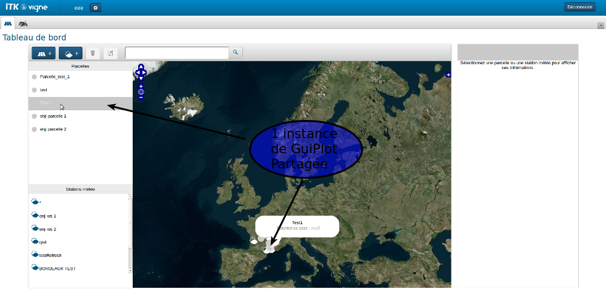

!SLIDE ============================

# GWT

"La meilleure réalisation technique, de la plus mauvaise idée !"

*Ce slide est réalisé en AngularJS !*

!SLIDE ============================

# Bienvenu dans le monde merveilleux du web


!SLIDE bullets small ============================

#Nous allons parler de

* RPC vs RF
* GuiModel : faire un modèle client side
* Pattern Observer : rendre réactif son app simplement
* Activity/View/ViewImpl/ui.xml : où on met quoi ?
* F5 : quand ? pourquoi ?

<i>Cette formation décrit des faits réels !</i>

!SLIDE bullets small ============================

<i>Wikipedia : </i>

* RPC : (Remote Procedure Call) est un protocole réseau permettant de faire des appels de procédures sur un ordinateur distant à l'aide d'un serveur d'applications.

<i>Google (approximatif car traduit par moi) : </i>

* RF : Idem à RPC mais permet une approche basée sur la donnée au lieu des services.

!SLIDE ============================

#RPC


!SLIDE ============================

#Controller - Interface

```java
@RemoteServiceRelativePath("plots")
public interface PlotsController extends RemoteService {

  List<Plot> getPlots(Integer idUser);

}
```

!SLIDE ============================

#Controller - Implémentation

```java
public class PlotsControllerImpl extends RemoteServiceServlet implements PlotsController {

  @Autowire
  PlotsService plotsService;

  public List<Plot> getPlots(Integer idUser) {
    return plotsService.getPlots(idUser);
  }

}
```

!SLIDE ============================

#Client - Interface

```java

public interface PlotsControllerAsync {
  void getPlots(Integer idUser, AsyncCallback<List<Plot>> callback);
}
```

!SLIDE ============================

#Client - Call

```java
List<Plot> plots;

AsyncCallback<List<Plot>> callback = new AsyncCallback<List<Plot>>() {
  public void onFailure(Throwable caught) {
    // TODO: Do something with errors.
  }

  public void onSuccess(List<Plot> plots) {
    MaClass.this.plots = plots;
  }
};

this.plots.size();//null pointer ! WTF ? 
```

!SLIDE ============================

#Et le plot dans tout ça ?

```java
public class Plot implements Serializable {
  
  private String name;

  public Plot() {}

  public String getName() {
    return name;
  }

  public void setName(String name) {
    this.name = name;
  }

}
```

!SLIDE bullets ============================

#Les points forts

* Directement accès à l'objet côté client (pas d'interface)
* Sérialization json "compréhensible" (demandez à Syloé)

!SLIDE bullets ============================

#Les points forts et faibles dépendent du point de vue !

```json
//OK[167,4.58444546972656,7,48.844317572283,
["java.util.ArrayList/4159755760",
"com.itkweb.devin.model.overview.PlotOverview/3902952073",
"java.lang.Integer/3438268394"]]
```

<i>Culture-G : Pourquoi Google à fait ça ?</i>

!SLIDE bullets ============================

#Les points faibles

* Directement accès à l'objet côté client (pas de différence client/Serveur possible)
* Tout l'objet transite (overview, dto...)
* Faire une copie de l'interface (Async, mais on a des générateurs xD)
* Sérialization json "compréhensible" (demandez à Syloé)

!SLIDE ============================

#RequestFactory

!SLIDE ============================

#Controller - Interface<font color="red">s</font>

```java
public interface ExpensesRequestFactory extends RequestFactory {

  PlotsRequest getPlotsRequest();

}

@Service(PlotsController.class)
public interface PlotsRequest extends RequestContext {

  Request<List<PlotProxy> getPlots(Integer userId);

}
```

!SLIDE ============================

#Controller - Implémentation

```java
public class PlotsControllerImpl extends RemoteServiceServlet implements PlotsController {

  @Autowire
  PlotsService plotsService;

  public List<Plot> getPlots(Integer idUser) {
    return plotsService.getPlots(idUser);
  }

}
```

!SLIDE ============================

#Client - Call

```java
List<PlotProxy> plots;

requestFactory.getPlotsRequest().getPlots(userId).fire(
  new Receiver<List<PlotProxy>>() {
    @Override
    public void onSuccess(List<PlotProxy> plots) {
      MaClass.this.plots = plots;
    }
  }
);

this.plots.size();//null pointer ! WTF ? 
```

!SLIDE ============================

#Et le plot dans tout ça ?

```java
public class Plot {
  private Integer id;
  private Integer version;
  ...
}

@ProxyFor(value = Plot.class, locator = JpaLocator.class)
public interface PlotOverviewProxy extends EntityProxy {
  public Integer getId();
  public Integer getVersion();
  public String getName();
}

public interface PlotProxy extends PlotOverviewProxy {
  public void setName(String name);
}
```

!SLIDE bullets ============================

#Les points forts

* DTO obligé
* Overview gratuit
* Seule la diff des objets reviennent au serveur

<i>Différence entre overview et DTO !</i>

!SLIDE bullets ============================

#Les points faibles

* Seule la diff des objets reviennent au serveur
* Interfaces côté client
* Sérialization json incompréhensible

!SLIDE bullets ============================

#RF : A savoir

* Delta objets et Jpa locator
* With
* Entity != Value
* Create, edited
* Frozen

!SLIDE smaller ============================

#RF : Delta des objets et Jpa locator


!SLIDE smaller ============================

#RF : With


!SLIDE ============================

#RF : With

```java
public interface PlotProxy extends PlotOverviewProxy {
  public void setName(String name);
  public UserProxy getOwner();
  public SimulationProxy getSimulation();
}

requestFactory
  .getPlotsRequest()
  .getPlots(userId)
  .with("owner", "simulation", "simulation.options")
  .fire(
    new Receiver<List<PlotProxy>>() {
      @Override
      public void onSuccess(List<PlotProxy> plots) {
        MaClass.this.plots = plots;
      }
    }
);
```

!SLIDE bullets ============================

#RF : Entity != Value

* Entity : tout le temps
* Value : jamais? isView !

!SLIDE ============================

#RF : Create, Edited

```java
PlotProxy plot = new PlotProxy();//TODO PlotProxy est une interface
```

!SLIDE ============================

#RF : Create, Edited

Mais en Javascript il n'y a pas d'interface ! WTF ? Ok on cheat :

```java
PlotProxy plot = GWT.create(PlotProxy.class);
```

!SLIDE ============================

#RF : Create, Edited

Plus précisément on utilise la request* :

```java
PlotProxy plot = requestFactory.getPlotRequest().create(PlotProxy.class);
```

```java
PlotProxy plotEdited = requestFactory.getPlotRequest().edite(plotProxy);
```

<i>* explication au prochain slide</i>

!SLIDE bullets ============================

#RF : Frozen

```java
java.lang.IllegalStateException: The AutoBean has been frozen
```

* Si l'objet proviens d'une autre requête
* Si l'objet a été mis en édition par une autre requête
* Si l'objet a été créé par une autre requête

!SLIDE ============================

#GuiModel

*Si on a une interface pour le modèle côté client, comment on fait pour créer des méthodes ?*

!SLIDE ============================

#Réponse la composition !


```java
public String getColor() {
  if(plotProxy.getSimulation().getLevel() == 2) {
    return "#FF000";
  } else if() {
    ...
  }
}
```

!SLIDE ============================

#Mais pourquoi on voudrait faire ça ?


!SLIDE ============================


!SLIDE ============================


!SLIDE ============================

#Pattern Observer


!SLIDE ============================

###Implémentation Observé

```java
public class GuiPlot {
  
  public interface Listener {
    public void onHoverChange(GuiPlot plot, boolean isHover);
  }

  private PlotProxy plot;
  private List<Listener> listeners;

  public GuiPlot(PlotProxy plot) {
    this.plot = plot;
  }
  
  public void setHover(boolean isHover) {
    for(Listener listener : listeners) {
      listener.onHoverChange(this, isHover);
    }
  }
}
```

!SLIDE ============================

###Implémentation Observateur

```java
GuiPlot guiPlot = new GuiPlot(plot);
guiPlot.addListener(new GuiPlot.Listener {
  public void onHoverChange(GuiPlot plot, boolean isHover) {
    //DO SOMETHING
  }
});
guiPlot.setHover(true);
```

!SLIDE ============================



1 seul appel à setHover(bool) fait 2 choses à la fois !

!SLIDE ============================

#Sans transition


#Activity/View/ViewImpl/ui.xml : où on met quoi ?

!SLIDE ============================

#Activity - Definition

An activity simply represents something the user is doing. An Activity contains no Widgets or UI code. Activities typically restore state ("wake up"), perform initialization ("set up"), and load a corresponding UI ("show up"). Activities are started and stopped by an ActivityManager associated with a container Widget.

*C'est pas moi qui le dit, mais Google en personne !*

!SLIDE bullets ============================

#Activity

* Une page de l'application (single page)
* Parle avec les "services" bas niveaux (network, cache...)
* Préviens d'un changement de page
* Mais aussi et surtout de démarrer la vue dans son contexte (par la méthode start)

!SLIDE bullets ============================

#WTF ?

* DasboardActivity
  * ListPlotActivity
  * MapActivity
  * DetailPlotActvity
* WeatherPpeActivity
  * Ppe1Activity
  * Ppe2Activity

!SLIDE bullets ============================

#Théorie MVP

* Modèle : pour pouvoir remplir vos vues
* Vue : pour les afficher
* Présenteur : attardons nous un peu là dessus 

!SLIDE bullets small ============================

#Presenter : rôle

* donner la bonne donnée à la vue, s'il le faut il va la chercher sur le serveur, la filtre, la trie...
* récupérer la donnée de la vue pour... l'enregistrer sur un serveur...
* de définir ce qu'il se passe lorsque l'on interagit avec la vue (clic sur un bouton, déplacement par d&d...) 

!SLIDE bullets ============================

#Activity/Presenter chez ITK

* Mix des 2
* Déplacement d'une partie de la gestion dans la vue

!SLIDE bullets ============================

#Activity/Presenter chez ITK

*Pourquoi ? Je sais pas...*

* Souvent le presenter n'était que de la tuyauterie
* ViewImpl vide avec les ui.xml
* Oubli de ce qu'est une activité !?
* Métier et donc front complexe !?

!SLIDE bullets small ============================

#Finalement

* ViewImpl.ui.xml : composants graphiques
* ViewImpl : gestion de la donnée (in/out)
* View : description des méthodes accessibles par/pour presenter
* Activity/Presenter : gestion de la vue avec le reste de l'appli/serveur

<i>Besoin d'un dessin ?</i>

!SLIDE bullets ============================

#F5 : quand ? pourquoi ?

* F5 != ctrl+R == ctrl+F5
* F5 client
* F5 serveur
* F5 shared :'(

!SLIDE ============================

#Merci ! Question ? Débat ?

