/*!SLIDE bullets ============================

Plan :
* Introduction : Je suis une buze en git
* Récupérer le code 1er coup : git clone
* Ajouter son code : git commit, push
* Récupérer le code : git pull --rebase
* Créer une branche : git checkout -b nom
* Switcher d'une branche à l'autre : git checkout nom
* Merger du code entre branche

*/

!SLIDE ============================

#GIT

Licence Complete Bullshit

Tout article ou image produite sous licence Complete Bullshit est reconnu d’inutilité publique. Tout y est ouvertement faux et scandaleusement mensonger, en général dans l’unique espoir d’aider à la LOLitude ambiante.


Toute action en justice serait donc ridicule puisque ça ne me ferait pas plaisir, d’autant que cela n’est pas très gentil.

<i><code>Avertissement, tous les trolls de ces slides sont en italique</code></i>

!SLIDE ============================

# Je suis une buze en GIT !

<i>Et c'est pas en italique</i>


!SLIDE ============================

# GIT histoire

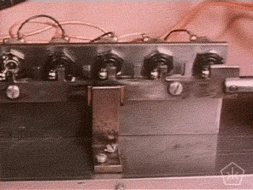

!SLIDE ============================

## Pouvoir décentraliser le code

<i>Mais si tout est sur github où est la décentralisation ?</i>


!SLIDE ============================

## Pouvoir créer des branches plus facilement

<i>Quand on sait dev on a pas besoin de branches !</i>


!SLIDE ============================

## Pouvoir revenir à un état antérieur du code plus facilement

<i>Quand on sait dev on a pas besoin de revenir en arrière !</i>


!SLIDE ============================

# GIT simple workflow

Avec GIT on peut faire comme SVN (comme h-day)

```
git clone repo.git                svn checkout svn://
git pull                         svn update
git add .                        svn commit -f .
git commit -m "commit message"     -m "commit message"
git push                             
```

<i>Les commandes SVN ne sont pas exactes !</i>

!SLIDE ============================

# GIT simple workflow

S'il vous plait ne faites pas ça !

Expérience personnelle : soit on utilise SVN, soit on utilise GIT !

!SLIDE ============================

Théorie

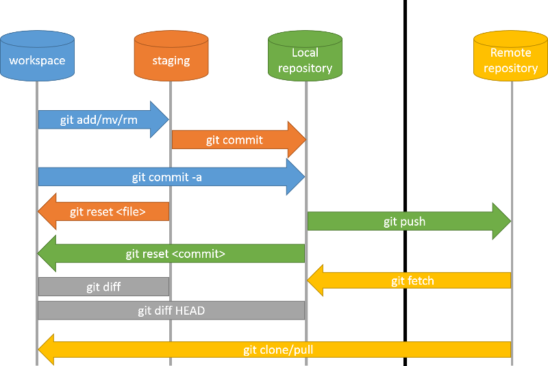

!SLIDE ============================

# GIT commandes de base en détail

!SLIDE small ============================

# Clone

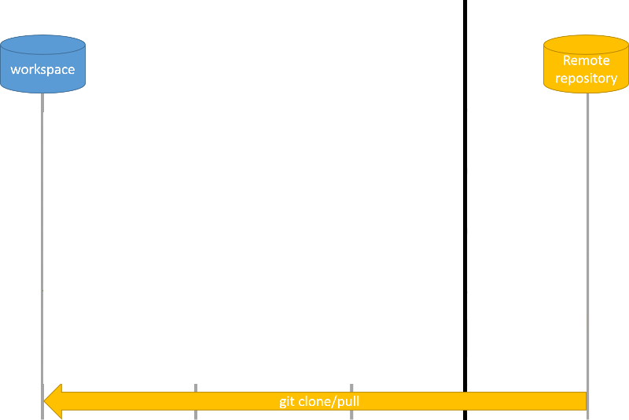

!SLIDE ============================

# Clone

```
git clone repo.git
```

Récupérer le code pour la première fois.


!SLIDE ============================

# Status

```
git status
```

Voir où on en est localement : fichiers à commiter, pusher, déjà commités...


!SLIDE small ============================

# Add/Rm/reset

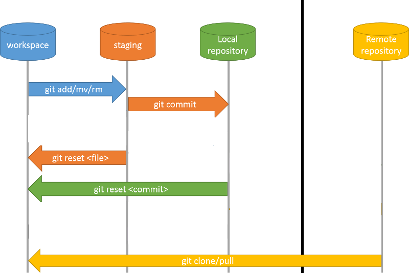

!SLIDE ============================

# Add

```
git add path/to/file
```

Ajouter dans la zone de staging les fichiers à commiter. On peut mettre `.` pour dire tous les fichiers.

!SLIDE ============================

# Rm

```
git rm path/to/file
```

Supprimer les fichiers ne sont plus à commiter (le . ne marche pas).

!SLIDE bullets ============================

# Reset

```
git reset id_commit
```

* Enlève de la zone de staging les fichiers à commiter.
* <quote>HEAD est un id commit particulier qui signifie : dernier commit du repo</quote>

!SLIDE small ============================

# Commit

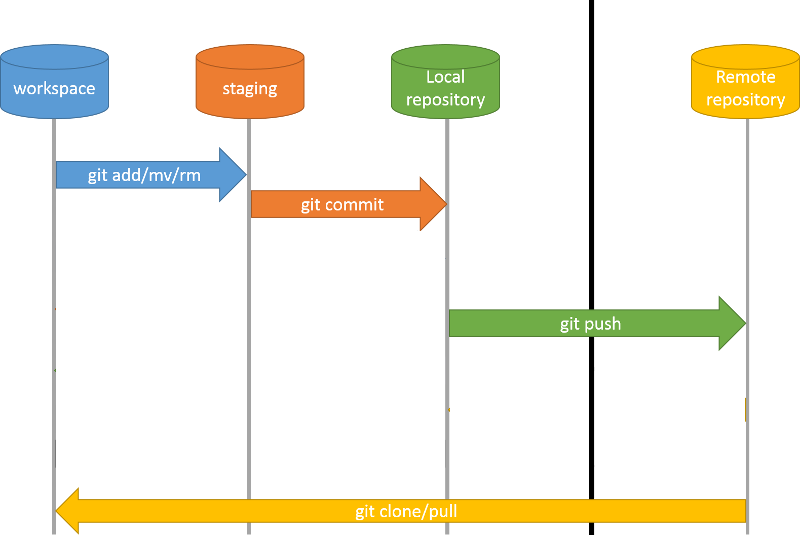

!SLIDE bullets small ============================

# Commit

```
git commit -m "message commit"
```

* Ajouter dans notre repo local, les fichiers en zone de staging.
* <quote>Avec GIT on ne peut pas commiter sans message !</quote>
* Si on ne met pas l'option -m, il ouvrira l'éditeur de texte par défaut du système.
* Si on ne met pas de texte, le commit ne sera pas valide, et donc im-push-able.

!SLIDE bullets small ============================

# Push

```
git push repo_name branch_name
```

* Envoyer nos modifications du repo local, vers le repo distant.
* On peut omettre le repo_name et la branch_name, ça sera alors `origin` et toutes les branches

!SLIDE small ============================

# Pull


!SLIDE ============================

# Pull

```
git pull --rebase
```

Récupérer les fichiers distants et les merger dans notre repo local.


!SLIDE ============================

# Pull --rebase ??

Exemples...

!SLIDE ============================

## Dans menottes il y a... 1 branche !

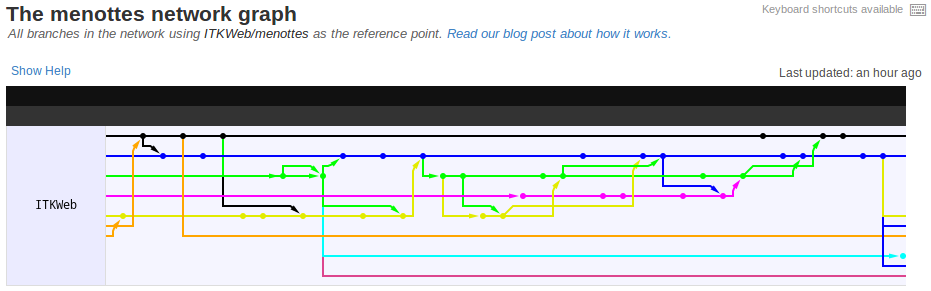


!SLIDE ============================

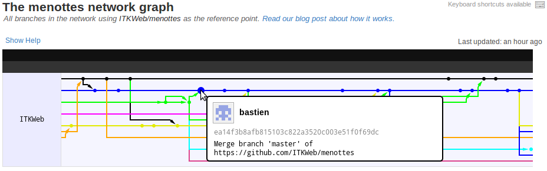

!SLIDE ============================

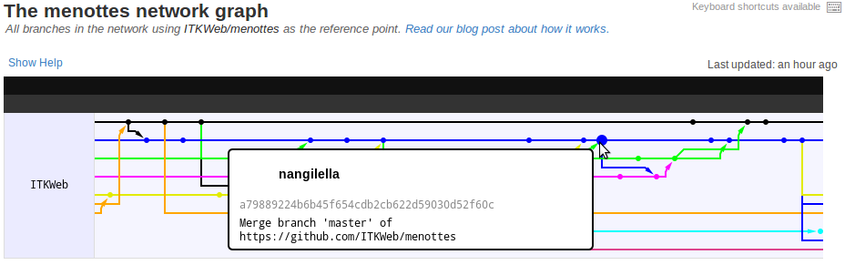

!SLIDE ============================

# 1ere solution : on fait tout pour pas se marcher sur les pieds 

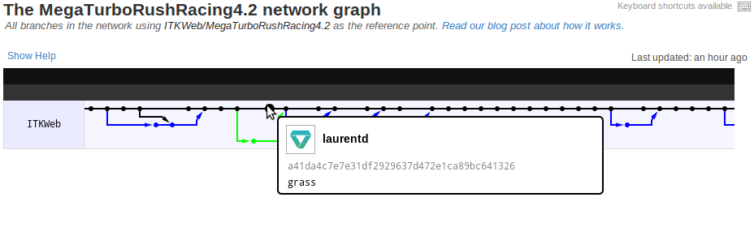

!SLIDE ============================

# ça peut marcher

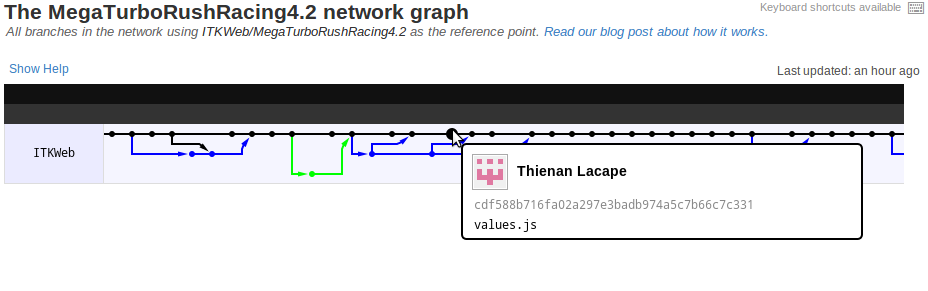

!SLIDE ============================

# Solution 2 : on --rebase

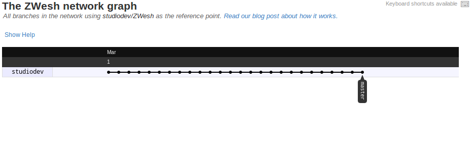


!SLIDE ============================

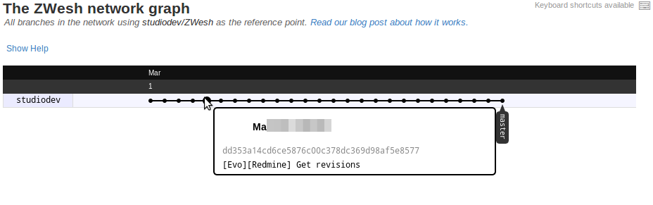

!SLIDE ============================

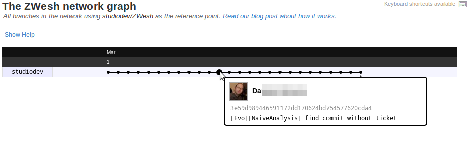

!SLIDE ============================

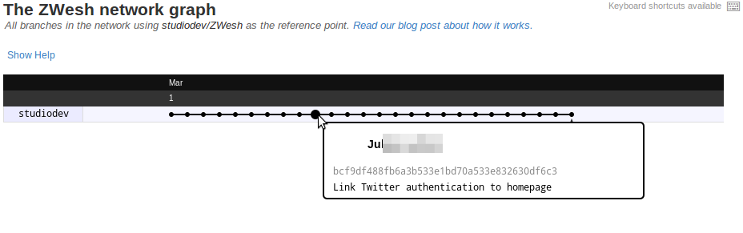

!SLIDE ============================

# Nouveau workflow de travail


!SLIDE ============================

```
git checkout -b mon_prenom
while(!fini) {
	git add .
	git commit -m "boulot..."
	git pull --rebase origin master
	git merge master
}
git checkout master
git pull --rebase
git merge mon_prenom
git add .
git commit -m "ma tâche est finie"
git push
git checkout mon_prenom
```

!SLIDE ============================

# En détail


!SLIDE ============================

```
git checkout -b mon_prenom
```

Créer une branche `nom_prenom` (-b) et nous place dedans.

!SLIDE ============================

```
git pull --rebase origin master
```

Récupère proprement le code distant de la branche `master`.

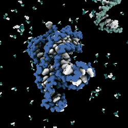

!SLIDE ============================

```
git merge master
```

Merge le code de la branche `master` dans la branche courante.

!SLIDE ============================

```
git checkout master
```

Nous place dans la branche `master`.

!SLIDE ============================

# Quand on doit merger à la main !

Pas panique git nous dit tout !

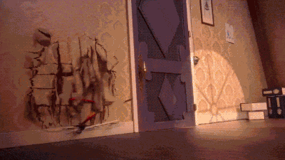

!SLIDE ============================

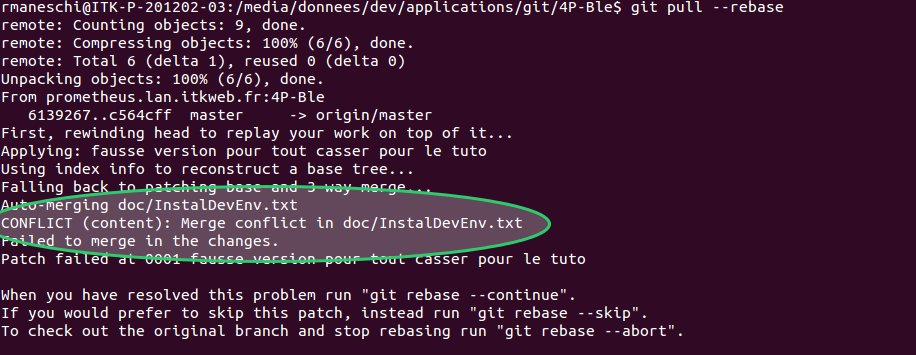

!SLIDE smaller bullets ============================

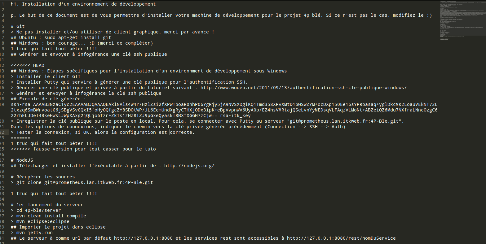

!SLIDE ============================

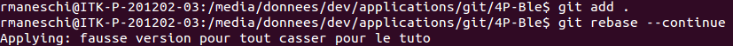

!SLIDE bullets ============================

# Résumé

* Pour le moment on peut faire le workflow simple
* En h-day il serait bien de commencer à brancher
* Idem, sur nos serveur de vm (1 branch par déploiement ?)

!SLIDE =================

# Merci !

# Questions ? Débat ? Troll !