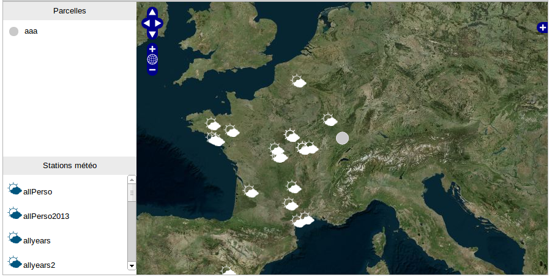
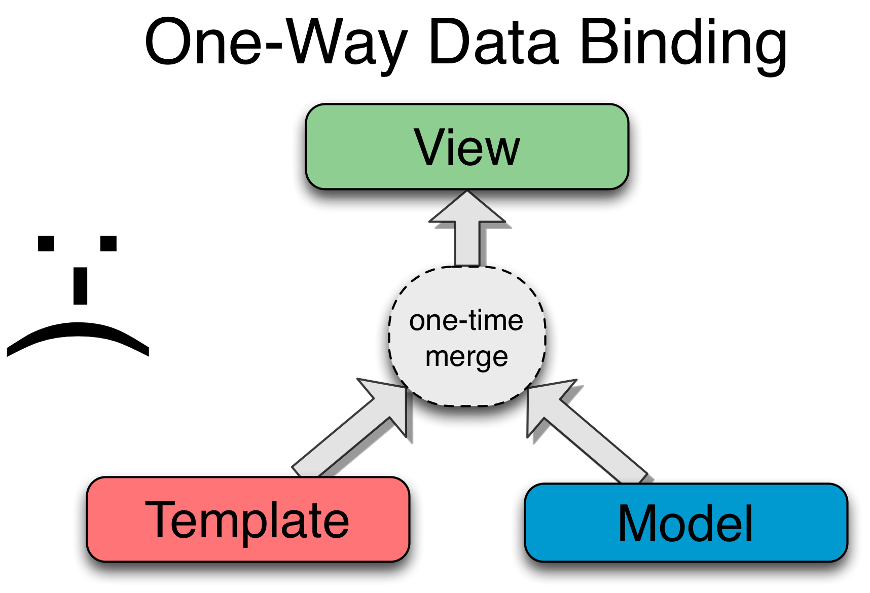
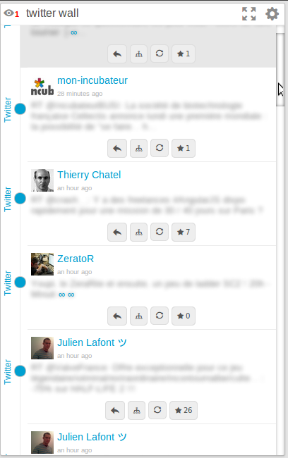
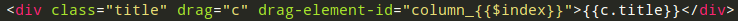
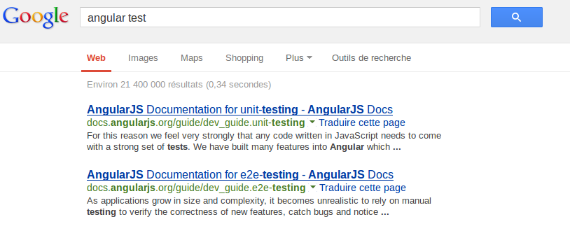
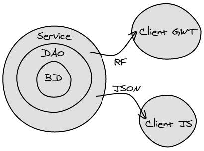

/*!SLIDE bullets ============================

Plan :

* GWT avant c'était bien mais ça c'était avant
* Si on fait du web pourquoi faire du java ?
* Préjugés : js c'est null, chaque browser à son implémentation de js, minifaction difficile, difficilement maintenable
* pb de map sur dispeau
* AngularJs philosophie (double binding)

* un peu de technique
* Modèle == json
* View --> html/css pas de fiouritures
* Controller == Activity + ViewImpl {{data}}
* Service
* Directive ! I LOVE IT !
* tests

* Défits : Serveur à découpler de gwt, Nouveau langage a découvrir
* Pb : IDE JetBrains WebStorm

* Ce que l'on perd : relation serveur/client facilité
* Ce que l'on gagne : vue plus facile (pas d'interface pour le css O_o), laurent peu faire beaucoup + de choses, test client intégré
*/

!SLIDE ============================

# GWT

"La meilleure réalisation technique, de la plus mauvaise idée !"

!SLIDE ============================

# Pourquoi ? 

Navigateurs == et même langage client/serveur

!SLIDE =====================

# TROLL

Ouéééé, bon FF marche quand même mieux !!!

!SLIDE ========================

# Si on fait du web pourquoi faire du java ?

Le seul langage à tourner sur tous les navigateurs est le javascript !

!SLIDE =================

# Parlons un peu de JS

!SLIDE =================

# TROLL

JS ça permet de faire des étoiles derrière la souris

!SLIDE =================

# TROLL

Chaque navigateur a sa propre implémentation

!SLIDE =================

# TROLL

Non testable, non maintenable...

!SLIDE =================

# Mais alors pourquoi y passer ?

!SLIDE =================

# Compiler du java vers JS/HTML/CSS
# WTF !?

!SLIDE =================

# Compiler du java vers JS/HTML/CSS
# JS est interprété !
# Un F5 devrait suffir !

!SLIDE =================

# Dispeau map

!SLIDE bullets =================

# Dispeau map

* Lib JS

!SLIDE bullets =================

# Dispeau map

* Lib JS
* Wrapper GWT

!SLIDE bullets =================

# Dispeau map

* Lib JS
* Wrapper GWT
* Compilation JS

!SLIDE bullets =================

# Dispeau map

Et si on prenait un tank pour tuer une mouche ?

!SLIDE =================

# AngularJs

!SLIDE =================

# Le serveur gère le métier, le client l'affiche...

!SLIDE =================

!SLIDE =================

!SLIDE =================

Your name: <input ng-model="me" name="name" autocomplete="off" style="font-size: 1em; width: 7em;"> 
Hello {{me}}!

 

    Your name: <input ng-model="me">
    Hello {{me}}!

!SLIDE bullets =================

# Fondamentaux

* Modèle --> json
* View.xml --> HTML/CSS
* ViewImpl --> Contôleur
* Activity --> Service

!SLIDE =================

# Directive == HTML6

&#60;monCompo mes-params="value">&#60;/monCompo>

!SLIDE =================

# I LOVE IT

!SLIDE =================

!SLIDE =================

!SLIDE =================

!SLIDE bullets =================

# Tests

* "La plupart des bugs viennent du client" <i>Cuong</i>
* "Tester les DAOs, puis les services côté serveur" <i>Bastien & Nelly</i>
* "Tester du java pour finalement jouer du js n'a pas de sens" <i>votre serviteur</i>

!SLIDE =================

!SLIDE =================

AngularJs == par les tests == pour les tests

!SLIDE =================

# Défis

!SLIDE =================

# Transfert des données

!SLIDE bullets =================

# Nouveau(x) langage(s)

* JS, HTML5, CSS3
* (presque) fonctionnel
* prototype
* dynamique

!SLIDE =================

# Problèmes

Et oui tout n'est pas si facile...

!SLIDE =================

# PAS D'IDE qui sort du lot

SublimeText, WebStorm, Brackets...

!SLIDE bullets =================

# Mais on y gagne...

* Vue plus facile (pas d'interface pour le css O_o)
* tests client intégrés
* découplage complet client/serveur
* serveur REST réutilisable (application mobile, native...)

!SLIDE bullets =================

* laurent peut faire beaucoup plus de choses

!SLIDE bullets =================

* Pas de photoshop ! Directement dans le code !

!SLIDE bullets =================

# Dans tous les cas n'oubliez pas :

* Roadmap GWT où Google ne fait rien
* AngularJs n'est qu'une des possibilités (ember, backbone...)

!SLIDE =================

# Merci !

!SLIDE =================

# Questions ? Débat ? Troll !